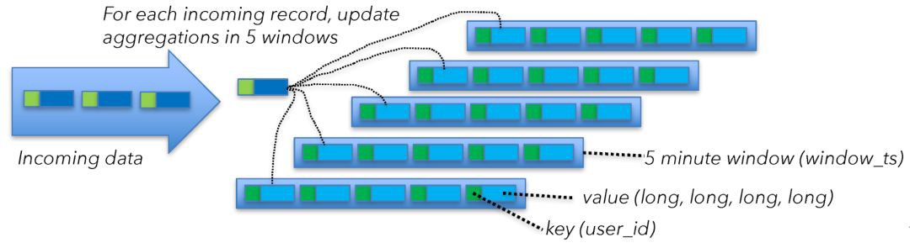

# 【Flink】从开发到生产上线如何确定集群规划大小

在 Flink 社区中，最常被问到的问题之一是：***在从开发到生产上线的过程中如何确定集群的大小***。这个问题的标准答案显然是“视情况而定”，但这并非一个有用的答案。

本文概述了一系列的相关问题，通过回答这些问题，或许你能得出一些数字作为指导和参考。计算并建立一个基线: 

1. 第一步是仔细考虑应用程序的运维指标，以达到所需资源的基线。需要考虑的关键指标是：

   - 每秒记录数和每条记录的大小
   - 已有的不同键（key）的数量和每个键对应的状态大小
   - 状态更新的次数和状态后端的访问模式

   - 最后，一个更实际的问题是与客户之间围绕停机时间、延迟和最大吞吐量的服务级别协议（sla），因为这些直接影响容量规划。

2. 接下来，根据预算，看看有什么可用的资源。例如：

   - 网络容量，同时把使用网络的外部服务也纳入考虑，如 Kafka、HDFS 等。

   - 磁盘带宽，如果您依赖于基于磁盘的状态后端，如 RocksDB（并考虑其他磁盘使用，如 Kafka 或 HDFS）

   - 可用的机器数量、CPU 和内存

基于所有这些因素，现在可以为正常运行构建一个基线，外加一个资源缓冲量用于恢复追赶或处理负载尖峰。建议您在建立基线时也考虑检查点期间（checkpointing）使用的资源情况。

## 示例

### 1.job流程

当前在假设的集群上计划作业部署，将建立资源使用基线的过程可视化。这些数字是粗略的值，它们并不全面——**在文章的最后将进一步说明在进行计算过程中遗漏的部分**。

本案例中，我将部署一个典型的 Flink 流处理作业，该作业使用 Flink 的 FlinkKafkaConsumer 从 Kafka 消息源中读取数据。然后使用带键的总计窗口运算符（keyed-window operator）进行转换运算。窗口运算符在时间窗口 5 分钟执行聚合。由于总是有新的数据，故将把窗口配置为 1 分钟的滑动窗口（sliding window -- 窗口时长5min, 滑动步长1min）。这意味着将在每分钟更新过去 5 分钟的聚合量。

流计算作业为每个用户 id 创建一个合计量。从 Kafka 消息源消费的每条消息大小（平均）为 2 kb。假设吞吐量为每秒 100 万条消息。

要了解窗口运算符（window operator）的状态大小，需要知道不同键的数目。在本例中，键（keys）是用户 id 的数量，即500000000(5亿)个不同的用户。对于每个用户，需要计算四个数字，每个数字存储为长整形（8字节）。

> 简而言之, 当前流作业接入 kafka数据源, 数据量每秒 100 万条, 每条数据大小 2KB, 数据总共包含5亿不同用户的数据, 这5亿用户的ID为4个Long型(8byte)的数字.

从开发到生产上线，如何确定集群规划大小 ?　

总结一下工作的关键指标：

- 消息大小：2 KB/msg
- 吞吐量：1000000 msg/秒


- 不同键数量：500000000（窗口聚合：每个键4个Long(8byte)）


- Checkpointing：每分钟一次。

  


### 2.集群配置

假定的硬件设置如上图所示，共有五台机器在运行作业，每台机器运行一个Flink TaskManager（Flink 的工作节点）。磁盘是通过网络相互连接的（这在云设置中很常见），从主交换机到运行TaskManager的每台计算机都由一个 10 千兆位以太网连接。Kafka缓存代理（brokers）在不同的机器上分开运行。每台机器有 16个CPU核。为了简化处理，不考虑CPU和内存需求。

> 简而言之集群配置: 5台机器, 5个TM, 每台机器1个TM, 每台机器16Core, 10千兆以太网(10000Mbps,大约接近 10Gbps)

但实际情况中，根据应用程序逻辑和正在使用的状态后端，我们需要注意内存。这个例子使用了一个基于 RocksDB 的状态后端，它稳定并且内存需求很低。从单独的一台机器的视角要了解整个作业部署的资源需求，最容易的方法是先关注一台计算机和一个TaskManager 中的操作。然后可以使用一台计算机的数字来计算总体资源需求量。

默认情况下（如果所有运算符具有相同的并行度并且没有特殊的调度限制），流作业的所有运算符都在每一台计算机上运行。

在这种情况下，Kafka 源（或消息消费者）、窗口运算符和 Kafka 发送端（或消息生产者）都在这五台机器上运行。


从上图来看，keyBy 是一个单独运算符，因此计算资源需求更容易。实际上，keyBy 是一个 API 构造，并转换为 Kafka source 和窗口运算符（window operator）之间连接的配置属性。

### 3.资源配额分析

以下将自上而下地分析（上图）这些运算符，了解他们的网络资源需求。

1. The Kafka source

   要计算单个 Kafka 源（source）接收的数据量，我们首先计算 Kafka 的合计输入。这些 source 每秒接收 1000000 条消息，每条消息大小为 2 KB

   ```
   // 每秒钟消息总量大小
   2 KB x 1,000,000/s = 2 GB/s
   
   // 每台机器上 source端数据大小
   2 GB/s ÷ 5 台机器 = 400 MB/s
   ```

   群集中运行的 5 个 Kafka 源中的每一个都接收平均吞吐量为 400 MB/s 的数据结果。

   

   

2. The Shuffle / keyBy

   接下来，需要确保具有相同键（在本例中为用户 id）的所有事件都在同一台计算机上结束。正在读取的 Kafka 消息源的数据（在 Kafka 中）可能会根据不同的分区方案进行分区。

   Shuffle 过程将具有相同键的所有数据发送到一台计算机，因此需要将来自 Kafka 的 400 MB/s 数据流拆分为一个 user id 分区流：400 MB/s ÷ 5 台机器 = 80 MB/s

   平均而言，我们必须向每台计算机发送 80 MB/s 的数据。此分析是从一台机器的角度进行的，这意味着某些数据已经在指定的目标机器运行了(这里指的是分区数据中有 80 MB 是在本地机器运行, 不会发生交换)，因此减去 80 MB/s 即可, 400 MB/s - 80 MB = 320 MB/s 

   ***可以得到结果：每台机器以 320 MB/s 的速率接收和发送用户数据。***

   

   

3. Window 窗口输出

   下一个要问的问题是 Window Operator 发出多少数据并发送到 FlinkKafkaProducer。答案是 67 MB/s，我们来解释一下我们是怎么得到这个数字的。

   Window Operator 为每个键（key）保留 4 个数字（表示为长整形）的聚合值。Window Operator 每分钟发出一次当前聚合总值。每个键从聚合中发出 2 个整形（user_id, window_ts）和 4 个长整形：（2 x 4 字节）+（4 x 8 字节）= 每个键 40 字节然后将键的总数（500000000 除以机器数量）计算在内：100000000 个 keys x 40 个字节 = 4 GB ( 从每台机器来看 ) 然后计算每秒大小：4 GB/ 分钟 ÷ 60 = 67 MB/ 秒 （由每个任务管理器发出）

   > 这里的意思是: window operator需要每个窗口的内聚合的数据发到下游 Kafka, 这个key 是 (user Id, windowId), userId=32byte, windowId=8byte, 所以这个 key 的大小为 40 byte, 5 亿个 key 如果被均匀分散到各台机器, 每台机器的 1 亿个 key 的总大小就是 100000000 x 40 个字节 = 4 GB = 67 MB/ 秒
   >
   > 这里有两点疑问:
   >
   > 1. kafka 每秒 100 万的数据, 最多也就 100 万个 userId, 5个TM, 每个 TM 的 source端每秒只接受 20 万条数据, keyBy 之后 window operator 每秒数据量平均也就 20 万, 20 万条数据最多也就 20 万的 userId. 窗口内聚合数据量 200000 x 40 个字节 = 7.63 MB/秒 发往下游 kafka
   > 2. 做 checkpoint 的流量不计算么?

   这意味着每个任务管理器平均从窗口运算符发出 67 MB/s 的用户数据。由于每个任务管理器上都有一个 Kafka 发送端（和窗口运算符在同一个任务管理器中），并且没有进一步的重新分区，所以这得到的是 Flink 向 Kafka 发送的数据量。用户数据：从 Kafka，分发到窗口运算符并返回到 Kafka窗口运算器的数据发射预计将是“突发”的，因为它们每分钟发送一次数据。实际上，运算符不会以 67 mb/s 的恒定速率给客户发送数据，而是每分钟内将可用带宽最大化几秒钟。

   这些总计为：

   - 数据输入：每台机器 720 MB/s（400+320）
   - 数据输出：每台机器 387 MB/s（320+67）




4. 状态访问和检查点

   这不是全部的（内容）。到目前为止，我们只查看了 Flink 正在处理的用户数据。在实际情况中需要计入从磁盘访问的开销，包括到 RocksDB 的存储状态和检查点。要了解磁盘访问成本，请查看窗口运算符（window operator）如何访问状态。Kafka源也保持一定的状态，但与窗口运算符相比，它可以忽略不计。

   要了解窗口运算符（window operator）的状态大小，需要从不同的角度进行查看。Flink 正在用 1 分钟的滑动窗口计算 5 分钟的窗口量。Flink 通过维护五个窗口来实现滑动窗口，每次滑动都对应一个 1 分钟的窗口。如前所述，当使用窗口实现即时聚合时，将为每个窗口中的每个键（key）维护 40 字节的状态。对于每个传入事件，首先需要从磁盘检索当前聚合值（读取 40 字节），更新聚合值，然后将新值写回（写入 40 字节）。

   

   

   

   

5. 窗口状态

   这意味着：40 字节状态 x 5 个窗口 x 每台计算机 200000 msg/s = 40 MB/s

   即需要的每台计算机的读或写磁盘访问权限。如前所述，磁盘是网络相互连接的，因此需要将这些数字添加到总吞吐量计算中。现在总数是：

   - 数据输入：760 MB/s（400 MB/s 数据输入 + 320 MB/s 随机播放 + 40 MB/s

   状态）

   - 数据输出：427 MB/s（320 MB/s 随机播放 + 67 MB/s 数据输出 + 40 MB/s

   状态）

   上述考虑是针对状态访问的，当新事件到达窗口运算符时，状态访问会持续进行，还需要容错启用检查点。如果机器或其他部分出现故障，需要恢复窗口内容并继续处理。检查点设置为每分钟一个检查点，每个检查点将作业的整个状态复制到网络连接的文件系统中。

   让我们一起来看看每台计算机上的整个状态有多大：40 字节状态 x 5 个窗口 x 100000000 个 keys = 20 GB，并且，要获得每秒的值：20 GB ÷ 60 = 333 MB/ 秒

   与窗口运算类似，检查点是突发的，每分钟一次，它都试图将数据全速发送到外部存储器。Checkpointing 引发对 RocksDB 的额外状态访问（在本案例中，RocksDB 位于网络连接的磁盘上）。

   自 Flink 1.3 版本以来，RocksDB 状态后端支持增量 checkpoint，概念上通过仅发送自上一个 checkpoint 以来的变化量，减少了每个 checkpoint 上所需的网络传输，但本例中不使用此功能。

   这会将总数更新为：

   - 数据输入：760 MB/s（400+320+40）

   - 数据输出：760 MB/s（320+67+40+333）

   

   这意味着整个网络流量为：

   760 + 760 x 5 + 400 + 2335 = 10335 MB/ 秒

   400 是 5 台机器上 80 MB 状态访问（读写）进程的总和，2335 是集群上 Kafka 输入和输出进程的总和。

   

这大概是上图所示硬件设置中可用网络容量的一半以上。

补充一点，这些计算都不包括协议开销，例如来自 Flink、Kafka 或文件系统的 TCP、Ethernet 和 RPC 调用。但这仍然是一个很好的出发点，可以帮助您了解工作所需的硬件类型，以及性能指标。

扩展方法

基于以上分析，这个例子，在一个 5 节点集群的典型运行中，每台机器都需要处理 760 个 Mb/s 的数据，无论是输入还是输出，从 1250 Mb/s 的总容量来看，它保留了大约 40% 的网络容量因为部分被主观所简化的复杂因素，例如网络协议开销、从检查点恢复事件重放期间的重载，以及由数据歪斜引起的跨集群的负载不平衡。

对于 40% 的净空是否合适，没有一个一刀切的答案，但是这个算法应该是一个很好的起点。尝试上面的计算，更换机器数量、键（keys）的数量或每秒的消息数，选择要考虑的运维指标，然后将其与您的预算和运维因素相平衡。
