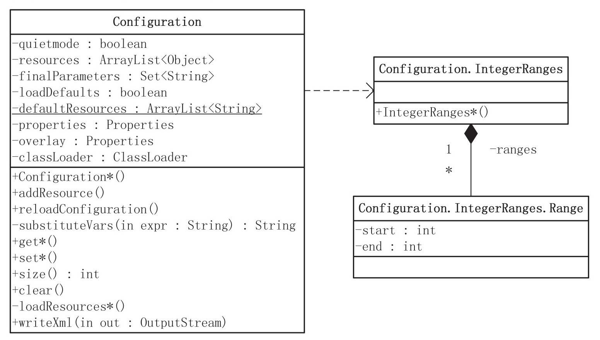

# 02 | Hadoop 配置信息的处理

任何一个复杂的软件系统，为了提高其适应性和扩展性，一般都会有一个配置模块或配置系统，作为其扩展、定制的手段和方式。Hadoop使用配置文件将系统中的重要属性以文件的形式进行持久化，使得这些属性可以被重启后的进程或者不同的进程使用。

## 一、配置文件简介

配置文件是一个灵活系统不可缺少的一部分，虽然配置文件非常重要，但却没有标准。本节我们来了解Windows操作系统和Java环境中的配置文件。

### 1.1　WindowsOS的配置文件

Windows系统广泛使用一种特殊化的ASCII文件（以"ini"为文件扩展名, 取"initialization"的前三个字母）作为它的主要配置文件标准。下面是INI文件的片段：

```ini
;最后修改时间：2012.10.12
[owner]
name=John Doe
organization=Acme Widgets Inc.
[database]
server=192.0.2.62；使用IP地址，在域名解析不能使用时还能正常工作
port=143
file="payroll.dat"
[ftp]
```

INI文件将配置信息分为“节”，节标题放在方括号("[]")中。如上面例子中的[database]，就是database节的节标题。每一个节可以包含一些与之相关的“项”（ENTRY），并通过等号对其进行赋值（VALUE）。一般的形式如下：

```ini
;注释
[SECTION]
ENTRY=VALUE
```

INI 文件中的 VALUE值可以有两种类型：

- 数型
- 字符串

上面给出的INI文件片段中，database节中包含3个项，分别是server、port和file。其中，配置项port可以以数型的形式读取。

INI 注释以分号开始，到行尾结束。

### 1.2 Java的配置文件

JDK 提供了 `java.util.Properties` 类，用于处理简单的配置文件。Properties 很早就被引入到Java的类库中，并且一直没有什么变化。它继承自 Hashtable，如下表示了一个持久的属性集，该集可保存在流中或从流中加载。***属性列表中每个键及其对应值都是字符串类型***。

```java
// Properties的继承关系

|-Object
		|--Dictionary<K, V>
				|--HashTable<K, V>
						|--Properties
								|--FontProperties
  							|--MessagesProperties
								|--Provider				
```

相对于INI文件，Properties处理的配置文件格式非常简单，它只支持键-值对，等号左边为键，右边为值。形式如下：

```properties
ENTRY=VALUE
```

由于Properties基于Hashtable，它并不能支持INI文件中的“节”，对配置项进行分类。

java.util.Properties 中用于处理属性列表的主要方法如下，其中，getProperty（）用于在属性列表中获取指定键（参数key）对应的属性。

它有两个形式，一个不提供默认值，另一个可以提供默认值。Properties.setProperty（）用于在属性列表中设置/更新属性值。相关代码如下：

```java
//用指定的键在此属性列表中搜索属性
public String getProperty（String key）
//功能同上，参数defaultValue提供了默认值
public String getProperty（String key, String defaultValue）

//最终调用Hashtable的方法put
public synchronized Object setProperty（String key, String value）
```

Properties中的属性通过load（）方法加载，该方法从输入流中读取键-值对，而store（）方法则将Properties表中的属性列表写入输出流。使用输入流和输出流，Properties对象不但可以保存在文件中，而且还可以保存在其他支持流的系统中，如Web服务器。J2SE 1.5版本以后，Properties中的数据也可以以XML格式保存，对应的加载和写出方法是loadFromXML（）和storeToXML（）。

下面是以XML格式存在的Properties配置文件的例子。

```xml
＜?xml?version=“1.0”?encoding="UTF-8"?＞

＜！DOCTYPE?properties?SYSTEM "http：//java.sun.com/dtd/properties.dtd"＞

＜properties＞
	＜comment＞Hi＜/comment＞
	＜entry?key="foo"＞bar＜/entry＞
	＜entry?key="fu"＞baz＜/entry＞
＜/properties＞
```

由于java.util.Properties提供的能力有限，Java社区中出现了大量的配置信息读/写方案，其中比较有名的是 Apache Jakarta Commons 工具集中提供的 Commons Configuration。

Commons Configuration 主要有如下几个特点:

- Commons Configuration 中的 PropertiesConfiguration 类提供了丰富的访问配置参数的方法。
- Commons Configuration支持文本、XML配置文件格式；
- 支持加载多个配置文件；
- 支持分层或多级的配置；
- 同时提供对单值或多值配置参数的基于类型的访问;

应该说，Commons Configuration 是一个功能强大的配置文件处理工具。

## 二、Hadoop Configuration详解

Hadoop使用了一套独有的配置文件管理系统，并提供自己的API，即使用`org.apache.hadoop.conf.Configuration`处理配置信息。

### 2.1　Hadoop的配置文件格式

Hadoop配置文件采用XML格式，下面是Hadoop配置文件的一个例子：

```xml
＜?xml version=“1.0”?＞
＜?xml-stylesheet type="text/xsl"href="configuration.xsl"?＞

＜configuration＞
	＜property＞
		＜name＞io.sort.factor＜/name＞
		＜value＞10＜/value＞
		＜description＞The number of streams to merge at once while sorting files.This determines the number of open file handles.＜/description＞
	＜/property＞

	＜property＞
		＜name＞dfs.name.dir＜/name＞
		＜value＞${hadoop.tmp.dir}/dfs/name＜/value＞
		＜description＞Determines where on the local filesystem the DFS namenode should store the name table（fsimage）.……＜/description＞		
	＜/property＞
	
	＜property＞
		＜name＞dfs.web.ugi＜/name＞
		＜value＞webuser, webgroup＜/value＞
		＜final＞true＜/final＞
		＜description＞The user account used by the web interface. Syntax：USERNAME, GROUP1，GROUP2，……＜/description＞
	＜/property＞

＜/configuration＞
```

Hadoop配置文件的根元素是configuration，一般只包含子元素property。每一个property元素就是一个配置项，配置文件不支持分层或分级。每个配置项一般包括配置属性的名称name、值value和一个关于配置项的描述description；元素final和Java中的关键字final类似，意味着这个配置项是“固定不变的”。***final一般不出现，但在合并资源的时候，可以防止配置项的值被覆盖***。

在 Configuration中，**每个属性(name)都是String类型，但是值(value)类型可以是以下多种类型**，包括Java中的基本类型，如boolean（getBoolean）、int（getInt）、long（getLong）、float（getFloat），也可以是其他类型，如String（get）、java.io.File（getFile）、String数组（getStrings）等。以上面的配置文件为例，getInt（"io.sort.factor"）将返回整数10；而getStrings（"dfs.web.ugi"）返回一个字符串数组，该数组有两个元素，分别是webuser和webgroup。

合并资源指将多个配置文件合并，产生一个配置。如果有两个配置文件，也就是两个资源，如core-default.xml和core-site.xml，通过Configuration类的loadResources（）方法，把它们合并成一个配置。代码如下：

```java
Configurationconf=new Configuration();
conf.addResource("core-default.xml");
conf.addResource("core-site.xml");
```

如果这两个配置资源都包含了相同的配置项，而且前一个资源的配置项没有标记为final，那么，后面的配置将覆盖前面的配置。上面的例子中，core-site.xml中的配置将覆盖core-default.xml中的同名配置。如果在第一个资源（core-default.xml）中某配置项被标记为final，那么，在加载第二个资源的时候，会有警告提示。

Hadoop配置系统还有一个很重要的功能，就是属性扩展。如配置项dfs.name.dir的值是\${hadoop.tmp.dir}/dfs/name，其中，${hadoop.tmp.dir}会使用Configuration中的相应属性值进行扩展。如果hadoop.tmp.dir的值是"data"，那么扩展后的dfs.name.dir的值就是"data/dfs/name"。

使用Configuration类的一般过程是：构造Configuration对象，并通过类的 addResource（）方法添加需要加载的资源；然后就可以使用get*方法和set*方法访问/设置配置项，资源会在第一次使用的时候自动加载到对象中。

### 2.2　Configuration的成员变量



从类图可以看到，Configuration有7个主要的非静态成员变量。

1. `quietmode:boolean`

   用来设置加载配置的模式。如果quietmode为true（默认值），则在加载解析配置文件的过程中，不输出日志信息。quietmode只是一个方便开发人员调试的变量。

2. `resources: Array[Object]`

   保存了所有通过 addResource（）方法添加 Configuration对象的资源。

   Configuration. addResource（）有如下4种形式：

   ```java
   public void addResource（InputStream in）
   public void addResource（Path file）
   public void addResource（String name）//CLASSPATH资源
   public void addResource（URL url）
   ```

   也就是说，用户可以添加如下形式的资源：

   - 一个已经打开的输入流InputStream；
   - Hadoop文件路径org.apache.hadoop.fs.Path形式（后面会讨论Path类）的资源，如`hdfs://www.example.com:9000/conf/core-default.xml`
   - URL，如`http://www.example.com/core-default.xml`
   - CLASSPATH资源（String形式），前面提到的"core-default.xml"就是这种形式。

3. `loadDefaults: boolean`

   用于确定是否加载默认资源，这些默认资源保存在 `defaultResources: ArryList[String]` (静态成员变量)中。通过方法 addDefaultResource（）可以添加系统的默认资源。

   在 HDFS 中，会把 hdfs-default.xml 和 hdfs-site.xml作为默认资源，并通过addDefaultResource（）保存在成员变量defaultResources中；

   在 MapReduce 中，默认资源是 mapred-default.xml 和 mapred-site.xml。

   如 HDFS 的 DataNode 中，就有下面的代码，加载上述两个默认资源：

   ```java
   // org.apache.hadoop.hdfs.server.datanode.DataNode
   static{
   	Configuration.addDefaultResource（"hdfs-default.xml"）；
   	Configuration.addDefaultResource（"hdfs-site.xml"）；
   }
   
   ```

   

4. `properties`、`overlay`和`finalParameters`

   这3个都是和配置项相关的成员变量。properties 和 overlay 的类型都是前面介绍过的java.util.Properties。

   - properties: Properties 

     是用来存放 Hadoop 配置文件解析后的键-值对。

   - finalParameters: Set＜String＞ 

     用来保存所有在配置文件中已经被声明为final的键-值对的键，如前面配置文件例子中的键"dfs.web.ugi"。

   - overlay: Properties

     用于记录通过 set() 方式改变的配置项。也就是说，出现在overlay中的键-值对是应用设置的，而不是通过对配置资源解析得到的。

5. `classLoader: ClassLoader`

   这是一个类加载器变量，可以通过它来加载指定类，也可以通过它加载相关的资源。上面提到addResource（）可以通过字符串方式加载CLASSPATH资源，它其实通过Configuration中的getResource（）将字符串转换成URL资源，相关代码如下：

   ```java
   public URL getResource（String name）{
   	return classLoader.getResource（name）；
   }
   ```

   其中，getResource（）用于根据资源的名称查找相应的资源，并返回读取资源的URL对象。

   注意:这里的资源，指的是可以通过类代码以与代码基无关的方式访问的一些数据，如图像、声音、文本等，不是前面提到的配置资源。

了解了Configuration各成员变量的具体含义，Configuration类的其他部分就比较容易理解了，它们都是为了操作这些变量而实现的解析、设置、获取方法。

### 2.3　资源加载

Hadoop 的 addResource() 加载资源的方法实际做了 2 件事

1. 将资源对象放入 `resources: Array[Object]` 字段内，添加的资源并不会立即被加载。
2. 清空 `properties: Properties` 和 `finalParameters: Set＜String＞`。

```java
//以CLASSPATH资源为例
public void addResource(String name){
	addResourceObject(name);
}

//添加到成员变量 resources中
private synchronized void addResourceObject(Object resource){
	resources.add(resource);
	reloadConfiguration();
}

//会触发资源的重新加载
public synchronized void reloadConfiguration(){
	properties=null;
	finalParameters.clear();
}
```

静态方法 addDefaultResource（）也能清空 Configuration对象中的数据（非静态成员变量），这是通过类的静态成员 REGISTRY 作为媒介进行的。

静态成员 REGISTRY 记录了系统中所有的 Configuration 对象，所以，addDefaultResource（）被调用时，遍历 REGISTRY 中的元素并在元素（即Configuration对象）上调用reloadConfiguration（）方法，即可触发资源的重新加载，相关代码如下：

```java
public static synchronized void addDefaultResource(String name){
	if(！defaultResources.contains(name)){
		defaultResources.add(name);
		for(Configuration conf：REGISTRY.keySet()){
			if(conf.loadDefaults){
        //触发资源的重新加载
				conf.reloadConfiguration();
			}
		}
	}
}
```

成员变量 properties 中的数据，直到需要的时候才会加载进来。在 getProps（）方法中，如果发现 properties 为空，将触发 loadResources（）方法加载配置资源。这里其实采用了延迟加载的设计模式，当真正需要配置数据的时候，才开始分析配置文件。相关代码如下：

```java
private synchronized Properties getProps(){
	if(properties==null){
		properties = new Properties();
		loadResources(properties, resources, quietmode);
    ......
	}
}
```

Hadoop的配置文件都是XML形式，JAXP（Java API for XML Processing）是一种稳定、可靠的XML处理API，支持SAX（Simple API for XML）和DOM（Document Object Model）两种XML处理方法。

SAX提供了一种流式的、事件驱动的XML处理方式，但编写处理逻辑比较复杂，比较适合处理大的XML文件。

DOM 和 SAX 不同，其工作方式是：首先将XML文档一次性装入内存；然后根据文档中定义的元素和属性在内存中创建一个“树形结构”，也就是一个文档对象模型，将文档对象化，文档中每个节点对应着模型中一个对象；然后使用对象提供的编程接口，访问XML文档进而操作XML文档。由于Hadoop的配置文件都是很小的文件，因此 Configuration 使用DOM处理XML。

首先分析DOM加载部分的代码：

```java
private void loadResource(
  		Properties properties，
			Object name, 
  		boolean quiet){

  try{
    //得到用于创建DOM解析器的工厂
    DocumentBuilderFactory docBuilderFactory = 
        DocumentBuilderFactory.newInstance();

    // 忽略XML中的注释
    docBuilderFactory.setIgnoringComments(true);
    // 提供对XML名称空间的支持
    docBuilderFactory.setNamespaceAware(true);

    try{
      //设置XInclude处理状态为true，即允许XInclude机制
      docBuilderFactory.setXIncludeAware(true);
    } catc(UnsupportedOperationException e){
  ……
  }

	//获取解析XML的DocumentBuilder对象
	DocumentBuilder builder = 
    		docBuilderFactory.newDocumentBuilder();

	Document doc=null;
	Element root=null;

	//根据不同资源，做预处理并调用相应形式的DocumentBuilder.parse
  //资源是URL形式
	if(name instanceof URL){
		……
		doc=builder.parse(url.toString());
		……
	}else if(name instanceof String){ //CLASSPATH资源
		……
	}else if(name instanceof Path){	//资源是Hadoop Path形式的
		……
	}else if(name instanceof InputStream){//InputStream
		……
	}else if(name instanceof Element){	//处理configuration子元素
		root=（Element）name；
	}
	if(docnull＆＆rootnull){
		if(quiet)
			return；
		throw new RuntimeException（name+"not found"）；
}
```

一般的JAXP处理都是从工厂开始，通过调用DocumentBuilderFactory的newInstance（）方法，获得用于创建DOM解析器的工厂。这里并没有创建出DOM解析器，只是获得一个用于创建DOM解析器的工厂，接下来需要对上述 newInstance（）方法得到的 docBuilderFactory 对象进行一些设置，才能进一步通过DocumentBuilderFactory，得到DOM解析器对象builder。

针对DocumentBuilderFactory对象进行的主要设置包括：

- 忽略XML文档中的注释；
- 支持XML空间；
- 支持XML的包含机制（XInclude）。

XInclude 机制允许将 XML 文档分解为多个可管理的块，然后将一个或多个较小的文档组装成一个大型文档。也就是说，Hadoop的一个配置文件中，可以利用 XInclude 机制将其他配置文件包含进来一并处理，下面是一个例子：

```xml
＜configuration xmlns：xi="http：//www.w3.org/2001/XInclude"＞
……
＜xi：include href="conf4performance.xml"/＞
……
＜/configuration＞

```

通过XInclude机制，把配置文件conf4performance.xml嵌入到当前配置文件，这种方法更有利于对配置文件进行模块化管理，同时就不需要再使用Configuration.addResource（）方法加载资源conf4performance.xml了。

设置完DocumentBuilderFactory对象以后，通过docBuilderFactory.newDocumentBuilder（）获得了DocumentBuilder对象，用于从各种输入源解析XML。在loadResource（）中，需要根据Configuration支持的4种资源分别进行处理，不过这4种情况最终都调用DocumentBuilder.parse（）函数，返回一个DOM解析结果。

如果输入是一个DOM的子元素，那么将解析结果设置为输入元素。这是为了处理下面出现的元素configuration包含configuration子节点的特殊情况。

成员函数loadResource的第二部分代码，就是根据DOM的解析结果设置Configuration的成员变量properties和finalParameters。

在确认XML的根节点是configuration以后，获取根节点的所有子节点并对所有子节点进行处理。这里需要注意，元素configuration的子节点可以是configuration，也可以是properties。如果是configuration，则递归调用loadResource（），在loadResource（）的处理过程中，子节点会被作为根节点得到继续的处理。

如果是property子节点，那么试图获取property的子元素name、value和final。在成功获得name和value的值后，根据情况设置对象的成员变量properties和finalParameters。相关代码如下：

```java
if(root==null){
	root=doc.getDocumentElement（）；
}

// 根节点应该是configuration
if(!"configuration".equals(root.getTagName()))
	LOG.fatal(“bad conf file：top-level element not＜configuration＞”);

//获取根节点的所有子节点
NodeList props=root.getChildNodes();
for(int i=0；i＜props.getLength(); i++){
	Node propNode=props.item(i);
	if(!(propNode instanceof Element))
		continue；//如果子节点不是Element，忽略

	Element prop= (Element)propNode；
	if("configuration".equals(prop.getTagName())){
		//如果子节点是configuration，递归调用loadResource进行处理
		//这意味着configuration的子节点可以是configuration
		loadResource(properties, prop, quiet);
		continue；
  }

	//子节点是property
	if(!"property".equals(prop.getTagName()))
		LOG.warn("bad conf file：element not＜property＞");

	NodeList fields=prop.getChildNodes();
	String attr=null;
	String value=null;
	boolean finalParameter=false;

	//查找name、value和final的值
	for（int j=0；j＜fields.getLength（）；j++）{
		Node fieldNode=fields.item（j）；
		if(!(fieldNode instanceof Element))
			continue;

		Element field=（Element）fieldNode；
		if("name".equals(field.getTagName() && field.hasChildNodes())
			attr=((Text)field.getFirstChild()).getData().trim();
		
		if（"value".equals(field.getTagName()) && field.hasChildNodes())
			value=（(Text)field.getFirstChild()).getData();

		if("final".equals(field.getTagName()) && field.hasChildNodes())
			finalParameter = "true".equals(((Text)field.getFirstChild()).getData());
	}

	if(attr！=null && value！=null){
		//如果属性已经标志为'final'，忽略
		if(!finalParameters.contains(attr)){
			//添加键-值对到properties中
			properties.setProperty(attr, value);

      if(finalParameter){
        //该属性标志为'final'，添加name到finalParameters中
        finalParameters.add(attr);
      }
		}
	……
	}
}
//处理异常
……
```

### 2.4　使用get/set修改配置项

