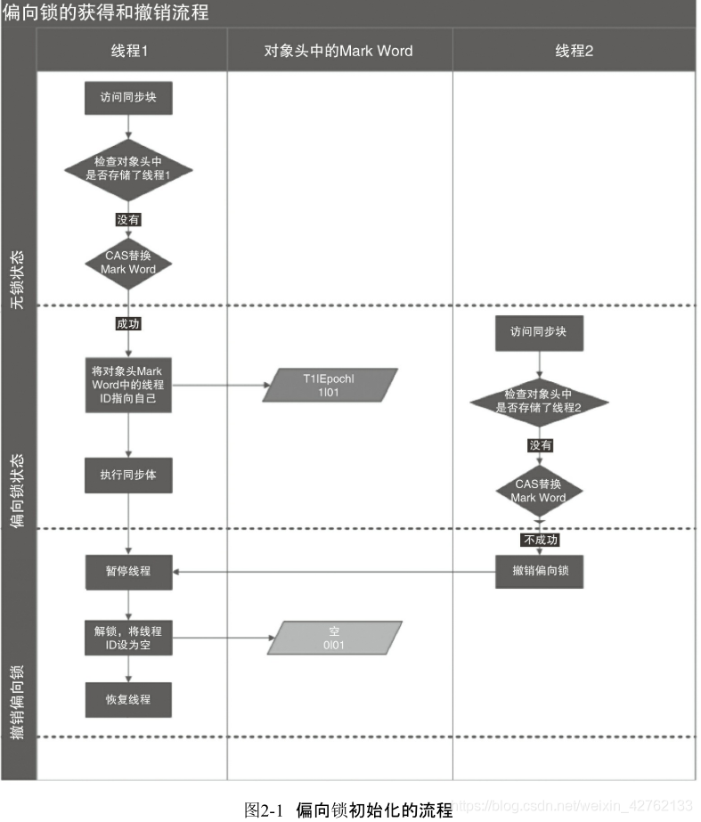
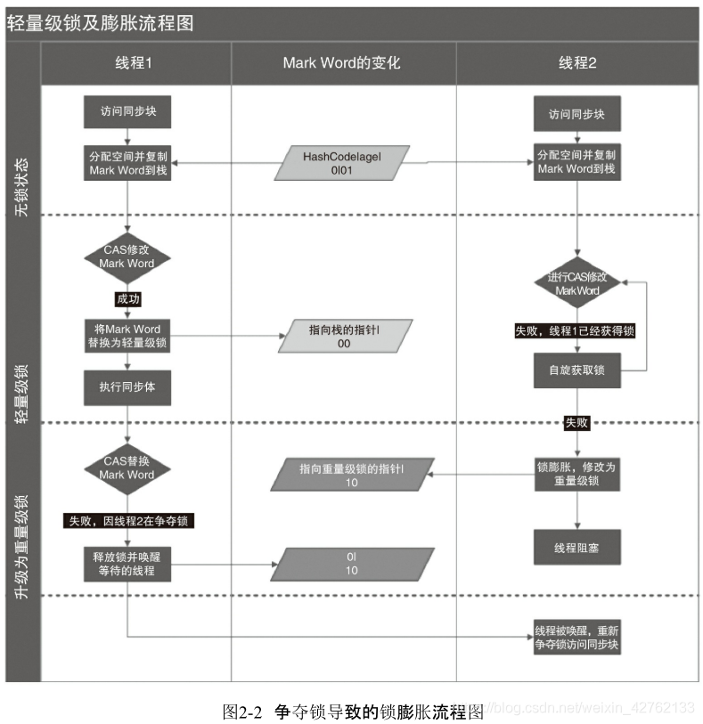

# 【JUC】synchronized原理深度解析

## 一、synchronized 简介

`synchronized` 是 java 中最常用的保证线程安全的方式，`synchronized` 的作用主要有三方面：(原子性, 有序性, 可见性)

1. 确保线程互斥的访问代码块，同一时刻只有一个方法可以进入到临界区
2. 保证共享变量的修改能及时可见
3. 有效解决重排序问题

语义上来讲，`synchronized`主要有三种用法：

1. 修饰普通方法，锁的是当前对象实例（this）
2. 修饰静态方法，锁的是当前 Class 对象（静态方法是属于类，而不是对象）
3. 修饰代码块，锁的是括号里的对象

## 二、synchronized 实现原理

### 2.1. 监视器锁

`synchronized`  同步代码块的语义底层是基于对象内部的监视器锁（`monitor`），分别是使用 `monitorenter` 和 `monitorexit` 指令完成。其实 `wait/notify` 也依赖于 `monitor` 对象，所以其一般要在 `synchronized`  同步的方法或代码块内使用。`monitorenter` 指令在编译为字节码后插入到同步代码块的开始位置，`monitorexit`  指令在编译为字节码后插入到方法结束处和异常处。JVM 要保证每个 `monitorenter` 必须有对应的 `moniorexit`。

- `monitorenter`：每个对象都有一个监视器锁（`monitor`），当 `monitor` 被某个线程占用时就会处于锁定状态，线程执行 `monitorenter` 指令时尝试获得 `monitor` 的所有权，即尝试获取对象的锁。过程如下：
  1. 如果 `monitor` 的进入数为0，则线程进入 `monitor`，然后将进入数设置为1，该线程即为 `monitor` 的所有者；
  2. 如果线程已经占有`monitor`，只是重新进入，则`monitor`的进入数+1；
  3. 如果其他线程已经占用 `monitor`，则该线程处于阻塞状态，直至 `monitor` 的进入数为0，再重新尝试获得 `monitor` 的所有权

- `monitorexit`：执行 `monitorexit` 的线程必须是 `objectref` 所对应的 `monitor` 的所有者。执行指令时，`monitor`  的进入数减1，如果减1后进入数为0，则线程退出 `monitor`，不再是这个 `monitor` 的所有者，其他被这个 `monitor`  阻塞的线程可以尝试获取这个 `monitor` 的所有权。

### 2.2. 线程状态和状态转化

在 HotSpot JVM 中，`monitor` 由 `ObjectMonitor` 实现，其主要数据结构如下：

```
ObjectMonitor() {
    _header       = NULL;
    _count        = 0;      //记录个数
    _waiters      = 0,
    _recursions   = 0;
    _object       = NULL;
    _owner        = NULL;   //持有monitor的线程
    _WaitSet      = NULL;   //处于wait状态的线程，会被加入到_WaitSet
    _WaitSetLock  = 0 ;
    _Responsible  = NULL ;
    _succ         = NULL ;
    _cxq          = NULL ;
    FreeNext      = NULL ;
    _EntryList    = NULL ;  //处于等待锁block状态的线程，会被加入到该列表
    _SpinFreq     = 0 ;
    _SpinClock    = 0 ;
    OwnerIsThread = 0 ;
  }
```

`ObjectMonitor` 中有两个队列，`_WaitSet` 和 `_EntryList`，用来保存 `ObjectWaiter` 对象列表（每个等待锁的线程都会被封装成 `ObjectWaiter` 对象），`_owner` 指向持有 `ObjectMonitor` 对象的线程。

1. 当多个线程同时访问一段同步代码时，首先会进入 _EntryList，等待锁处于阻塞状态。
2. 当线程获取到对象的 monitor 后进入 The Owner 区域，并把 ObjectMonitor 中的 _owner 变量设置为当前线程，同时 monitor 中的计数器 count 加1。
3. 若线程调用 wait() 方法，将释放当前持有的 monitor，_owner 变量恢复为 null，count 减1，同时该线程进入 _WaitSet 集合中等待被唤醒，处于 waiting 状态。
4. 若当前线程执行完毕，将释放 monitor 并复位变量的值，以便其他线程进入获取 monitor。

过程如下图:


## 三、锁优化

在 JDK1.6 之后，出现了各种锁优化技术，如轻量级锁、偏向锁、适应性自旋、锁粗化、锁消除等，这些技术都是为了在线程间更高效的解决竞争问题，从而提升程序的执行效率。

通过引入轻量级锁和偏向锁来减少重量级锁的使用。锁的状态总共分四种：无锁状态、偏向锁、轻量级锁和重量级锁。锁随着竞争情况可以升级，但锁升级后不能降级，意味着不能从轻量级锁状态降级为偏向锁状态，也不能从重量级锁状态降级为轻量级锁状态。

```
无锁状态 → 偏向锁状态 → 轻量级锁 → 重量级锁
```

### 3.1 对象头

一个Java对象在内存中包括对象头、实例数据和补齐填充3个部分：


要理解轻量级锁和偏向锁的运行机制，还要从对象头（Object Header）开始。对象头分为两部分：

1. Mark Word：存储对象自身的运行时数据，如：Hash Code，GC 分代年龄、锁信息。这部分数据在32位和64位的 JVM 中分别为 32bit 和 64bit。考虑空间效率，Mark Word 被设计为非固定的数据结构，以便在极小的空间内存储尽量多的信息，32bit的 Mark Word 如下图所示： 

   

2. 存储指向方法区对象类型数据的指针，如果是数组对象的话，额外会存储数组的长度

### 3.2 重量级锁

monitor 监视器锁本质上是依赖操作系统的 Mutex Lock 互斥量 来实现的，我们一般称之为`重量级锁`。因为 OS 实现线程间的切换需要从用户态转换到核心态，这个转换过程成本较高，耗时相对较长，因此 synchronized 效率会比较低。

重量级锁的锁标志位为'10'，指针指向的是 monitor 对象的起始地址，关于 monitor 的实现原理上文已经描述了。

 

### 3.3 轻量级锁

`轻量级锁`是相对基于OS的互斥量实现的重量级锁而言的，它的本意是在没有多线程竞争的前提下，减少传统的重量级锁使用OS的互斥量而带来的性能消耗。

轻量级锁提升性能的经验依据是：`对于绝大部分锁，在整个同步周期内都是不存在竞争的`。如果没有竞争，轻量级锁就可以使用 CAS 操作避免互斥量的开销，从而提升效率。

#### 3.3.1 轻量级锁的加锁过程：

1. 线程在进入到同步代码块的时候，JVM 会先在当前线程的栈帧中建立一个名为锁记录（Lock Record）的空间，用于存储锁对象当前 Mark Word 的拷贝（官方称为  Displaced Mark Word），owner 指针指向对象的 Mark Word。此时堆栈与对象头的状态如图所示：

   


2. JVM 使用 CAS 操作尝试将对象头中的 Mark Word 更新为指向 Lock Record 的指针。如果更新成功，则执行步骤3；更新失败，则执行步骤4

3. 如果更新成功，那么这个线程就拥有了该对象的锁，对象的 Mark Word 的锁状态为轻量级锁（标志位转变为'00'）。此时线程堆栈与对象头的状态如图所示： 

   


4. 如果更新失败，JVM 首先检查对象的 Mark Word 是否指向当前线程的栈帧
   - 如果是，就说明当前线程已经拥有了该对象的锁，那就可以直接进入同步代码块继续执行
   - 如果不是，就说明这个锁对象已经被其他的线程抢占了，当前线程会尝试自旋一定次数来获取锁。如果自旋一定次数 CAS 操作仍没有成功，那么`轻量级锁`就要升级为`重量级锁`（锁的标志位转变为'10'），Mark Word 中存储的就是指向重量级锁的指针，后面等待锁的线程也就进入阻塞状态

#### 3.3.2 轻量级锁的解锁过程：

1. 通过 CAS 操作用线程中复制的 Displaced Mark Word 中的数据替换对象当前的 Mark Word 

2. 如果替换成功，整个同步过程就完成了 

3. 如果替换失败，说明有其他线程尝试过获取该锁，那就在释放锁的同时，唤醒被挂起的线程

### 3.4 偏向锁

`轻量级锁`是在无多线程竞争的情况下，使用 CAS 操作去消除互斥量；`偏向锁`是在无多线程竞争的情况下，将这个同步都消除掉。

偏向锁提升性能的经验依据是：`对于绝大部分锁，在整个同步周期内不仅不存在竞争，而且总由同一线程多次获得`。偏向锁会偏向第一个获得它的线程，如果接下来的执行过程中，该锁没有被其他线程获取，则持有偏向锁的线程不需要再进行同步。这使得线程获取锁的代价更低。

#### 3.4.1 偏向锁的获取过程：

1. 线程执行同步块，锁对象第一次被获取的时候，JVM 会将锁对象的 Mark Word 中的锁状态设置为偏向锁（锁标志位为'01'，是否偏向的标志位为'1'），同时通过 CAS 操作在 Mark Word 中记录获取到这个锁的线程的 ThreadID

2. 如果 CAS 操作成功。持有偏向锁的线程每次进入和退出同步块时，只需测试一下 Mark Word 里是否存储着当前线程的 ThreadID。如果是，则表示线程已经获得了锁，而不需要额外花费 CAS 操作加锁和解锁

3. 如果不是，则通过CAS操作竞争锁，竞争成功，则将 Mark Word 的 ThreadID 替换为当前线程的 ThreadID

#### 3.4.2 偏向锁的释放过程：

1. 当一个线程已经持有偏向锁，而另外一个线程尝试竞争偏向锁时，CAS 替换 ThreadID 操作失败，则开始撤销偏向锁。偏向锁的撤销，需要等待原持有偏向锁的线程到达全局安全点（在这个时间点上没有字节码正在执行），暂停该线程，并检查其状态

2. 如果原持有偏向锁的线程不处于活动状态或已退出同步代码块，则该线程释放锁。将对象头设置为无锁状态（锁标志位为'01'，是否偏向标志位为'0'）

3. 如果原持有偏向锁的线程未退出同步代码块，则升级为轻量级锁（锁标志位为'00'）

### 3.5. 总结

偏向锁、轻量级锁、重量级锁之间的状态转换如图所示（概括上文描述的锁获取和释放的内容）：


下面是这几种锁的比较：


### 3.6 其他优化

#### 3.6.1 适应性自旋

`自旋锁`：互斥同步时，挂起和恢复线程都需要切换到内核态完成，这对性能并发带来了不少的压力。同时在许多应用上，共享数据的锁定状态只会持续很短的一段时间，为了这段较短的时间而去挂起和恢复线程并不值得。那么如果有多个线程同时并行执行，可以让后面请求锁的线程通过自旋（CPU忙循环执行空指令）的方式稍等一会儿，看看持有锁的线程是否会很快的释放锁，这样就不需要放弃 CPU 的执行时间了。

`适应性自旋`：在轻量级锁获取过程中，线程执行 CAS  操作失败时，需要通过自旋来获取重量级锁。如果锁被占用的时间比较短，那么自旋等待的效果就会比较好，而如果锁占用的时间很长，自旋的线程则会白白浪费  CPU  资源。解决这个问题的最简答的办法就是：指定自旋的次数，如果在限定次数内还没获取到锁（例如10次），就按传统的方式挂起线程进入阻塞状态。JDK1.6 之后引入了自适应性自旋的方式，如果在同一锁对象上，一线程自旋等待刚刚成功获得锁，并且持有锁的线程正在运行中，那么 JVM  会认为这次自旋也有可能再次成功获得锁，进而允许自旋等待相对更长的时间（例如100次）。另一方面，如果某个锁自旋很少成功获得，那么以后要获得这个锁时将省略自旋过程，以避免浪费 CPU。

#### 3.6.2 锁消除

锁消除就是编译器运行时，对一些被检测到不可能存在共享数据竞争的锁进行消除。如果判断一段代码中，堆上的数据不会逃逸出去从而被其他线程访问到，则可以把他们当做栈上的数据对待，认为它们是线程私有的，不必要加锁。

```java
public String concatString(String s1, String s2, String s3) {
    StringBuffer sb = new StringBuffer();
    sb.append("a");
    sb.append("b");
    sb.append("c");
    return sb.toString();
}
```

在 StringBuffer.append() 方法中有一个同步代码块，锁就是sb对象，但 sb 的所有引用不会逃逸到 concatString() 方法外部，其他线程无法访问它。因此这里有锁，但是在即时编译之后，会被安全的消除掉，忽略掉同步而直接执行了。

#### 3.6.3 锁粗化

锁粗化就是 JVM 检测到一串零碎的操作都对同一个对象加锁，则会把加锁同步的范围粗化到整个操作序列的外部。以上述 concatString() 方法为例，内部的  StringBuffer.append() 每次都会加锁，将会锁粗化，在第一次 append() 前至 最后一个 append()  后只需要加一次锁就可以了。


2.3 锁升级

首先讲一下***《java并发编程的艺术》***中对这一现象的描述，非常简洁生动，但是在复习的时候发现随着理解的深入多了许多疑问，最后通过阅读jvm源码和大量的资料终于搞清了我的疑问，接下来和大家分享一下。

#### 2.3.1《java并发编程的艺术》的描述

------

 Java SE 1.6为了减少获得锁和释放锁带来的性能消耗，引入了“偏向锁”和“轻量级锁”，在Java SE 1.6中，锁一共有4种状态，级别从低到高依次是：***无锁状态、偏向锁状态、轻量级锁状态和重量级锁状态***，这几个状态会随着竞争情况逐渐升级。***锁可以升级但不能降级***，意味着偏向锁升级成轻量级锁后不能降级成偏向锁。这种锁升级却不能降级的策略，目的是为了提高获得锁和释放锁的效率，下文会详细分析。 

##### 2.3.1.1 偏向锁

HotSpot的作者经过研究发现，大多数情况下，锁不仅不存在多线程竞争，而且总是由同一线程多次获得，为了让线程获得锁的代价更低而引入了偏向锁。当一个线程访问同步块并获取锁时，会在对象头和栈帧中的锁记录里存储锁偏向的线程ID，以后该线程在进入和退出 同步块时不需要进行CAS操作来加锁和解锁，只需简单地测试一下对象头的Mark Word里是否存储着指向当前线程的偏向锁。如果测试成功，表示线程已经获得了锁。如果测试失败，则需要再测试一下Mark  Word中偏向锁的标识是否设置成1（表示当前是偏向锁）：如果没有设置，则使用CAS竞争锁；如果设置了，则尝试使用CAS将对象头的偏向锁指向当前线程。

> 这段引用中有几个信息:
>
> 1. 偏向锁是使用的 CAS 原理
> 2. 偏向锁在 Mark Work 中存储锁偏向的线程 ID
> 3. 被存储的线程在之后进出锁时, 只需要简单的测试对象头Mark Word 中是否存储指向当前线程的偏向锁

###### 1) 偏向锁撤销

偏向锁使用了一种等到竞争出现才释放锁的机制，所以当其他线程尝试竞争偏向锁时，持有偏向锁的线程才会释放锁。偏向锁的撤销，需要等待全局安全点（在这个时间点上没有正在执行的字节码）。它会首先暂停拥有偏向锁的线程，然后检查持有偏向锁的线程是否活着，  如果线程不处于活动状态，则将对象头设置成无锁状态；如果线程仍然活着，拥有偏向锁的栈会被执行，遍历偏向对象的锁记录，栈中的锁记录和对象头的Mark Word要么重新偏向于其他线程，要么恢复到无锁或者标记对象不适合作为偏向锁，最后唤醒暂停的线程。图2-1中的线  程1演示了偏向锁初始化的流程，线程2演示了偏向锁撤销的流程。



###### 2) 偏向锁关闭

偏向锁在Java 6和Java 7里是默认启用的，但是它在应用程序启动几秒钟之后才激活，如有必要可以使用JVM参数来关闭延迟：-`XX:BiasedLockingStartupDelay=0`。如果你确定应用程 序里所有的锁通常情况下处于竞争状态，可以通过JVM参数关闭偏向锁：-`XX:UseBiasedLocking=false`，那么程序默认会进入轻量级锁状态。

##### 2.3.1.2 轻量级锁

###### 1) 轻量级锁加锁

线程在执行同步块之前，JVM会先在当前线程的栈桢中创建用于存储锁记录的空间，并将对象头中的Mark  Word复制到锁记录中，官方称为Displaced Mark Word。然后线程尝试使用 CAS将对象头中的Mark  Word替换为指向锁记录的指针。如果成功，当前线程获得锁，如果失 败，表示其他线程竞争锁，当前线程便尝试使用自旋来获取锁。

###### 2) 轻量级锁解锁

轻量级解锁时，会使用原子的CAS操作将Displaced Mark Word替换回到对象头，如果成功，则表示没有竞争发生。如果失败，表示当前锁存在竞争，锁就会膨胀成重量级锁。图2-2是 两个线程同时争夺锁，导致锁膨胀的流程图。



因为自旋会消耗CPU，为了避免无用的自旋（比如获得锁的线程被阻塞住了），一旦锁升级成重量级锁，就不会再恢复到轻量级锁状态。当锁处于这个状态下，其他线程试图获取锁时， 都会被阻塞住，当持有锁的线程释放锁之后会唤醒这些线程，被唤醒的线程就会进行新一轮 的夺锁之争。

------

到此，我们可以看到一个锁升级的轮廓了，但是看完之后有一些细节却让我更加迷惑，最后经过思考后，我发现作者给出的图片和描述适用的是当两个线程拥有同样锁等级同时竞争时的状况。 下面是我关于锁升级的一些思考

#### 2.3.2一些补充和验证

我们首先验证一下java6以后默认开启偏向锁，它在应用程序启动几秒钟之后才激活。
使用JOL工具类，打印对象头

```xml
<dependency>
  <groupId>org.openjdk.jol</groupId>
  <artifactId>jol-core</artifactId>
  <version>0.8</version>
</dependency>
```

