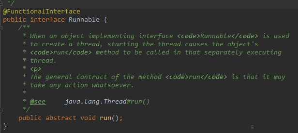
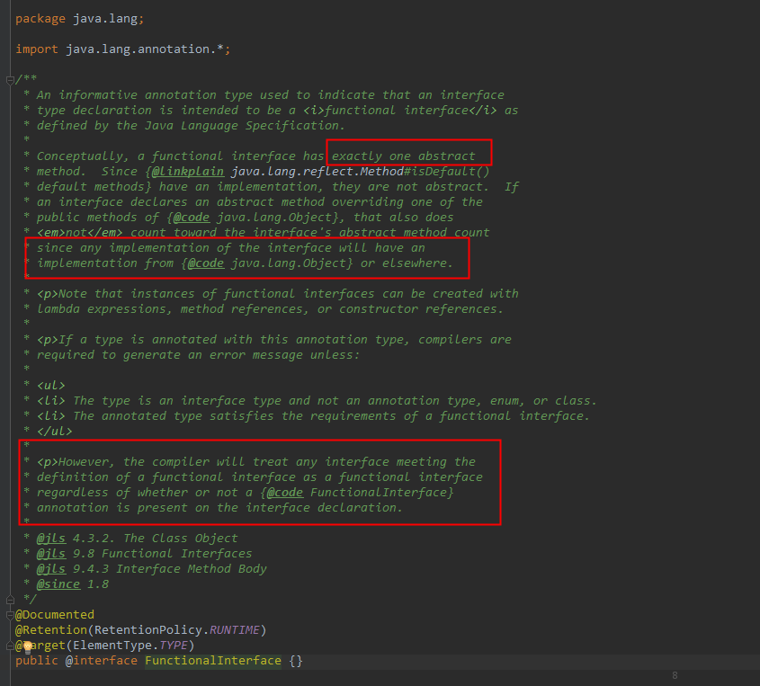
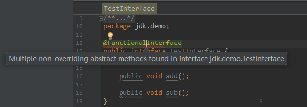

# 【Java8】@FunctionalInterface

我们常用的一些接口`Callable`、`Runnable`、`Comparator`等在JDK8中都添加了`@FunctionalInterface`注解。





通过JDK8源码javadoc，可以知道这个注解有以下特点：

1. 该注解只能标记在"有且仅有一个抽象方法"的接口上。
2. JDK8接口中的[静态方法和默认方法](http://blog.csdn.net/aitangyong/article/details/54134385)，都不算是抽象方法。
3. 接口默认继承`java.lang.Object`，所以如果接口显示声明覆盖了`Object`中方法，那么也不算抽象方法。
4. 该注解不是必须的，如果一个接口符合"函数式接口"定义，那么加不加该注解都没有影响。加上该注解能够更好地让编译器进行检查。如果编写的不是函数式接口，但是加上了`@FunctionInterface`，那么编译器会报错。

**`@FunctionalInterface`标记在接口上，“函数式接口”是指仅仅只包含一个抽象方法的接口**。

如果一个接口中包含不止一个抽象方法，那么不能使用`@FunctionalInterface`，编译会报错。



比如下面这个接口就是一个正确的函数式接口：

```java
// 正确的函数式接口
@FunctionalInterface
public interface TestInterface {
	
  // 抽象方法
	public void sub();

	// java.lang.Object中的方法不是抽象方法
 	public boolean equals(Object var1);
	
  // default不是抽象方法
	public default void defaultMethod(){
	
  }
	// static不是抽象方法
	public static void staticMethod(){
	
  }
}
```