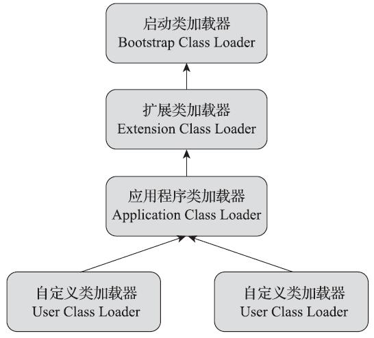

# 【Java】ClassLoader

ClassLoader 类加载器，日常 Java 开发中用到的不多，但对于框架开发者来说却非常常见。理解ClassLoader 的加载机制，即有利于我们 code 也对源码阅读十分有益。

ClassLoader 是一个抽象对象。给定了一个类的“二进制名称”(.class 文件)，ClassLoader 需要尝试去定位或者生成一个数据，该数据构成了一个定义的类。一个典型的策略就是转换名字（即，二进制名字）成一个文件名，然后从文件系统读取这个文件名包含的“字节码文件”。

> 这里所说的 class 文件不一定特指某个存在于磁盘上的具体文件, 而应该是一串二进制数据流, 无论其以何种形式存在, 包括不限于磁盘文件、网络、数据库、内存或者动态生成等。

这里有两种方式来通过一个“二进制名称”来加载一个类：

1. 定位
   即这个类的数据已经存在了，类加载器去定位到这个存储的数据进行加载即可。比如，java.lang.String就是在rt.jar中存储的了，可以直接定位到。
2. 生成
   一些在 java 代码中动态生成的类，而这些类的数据就是在运行期时由类加载器去生成的。比如，动态代理。

“二进制名称”：任意一个类名被提供作为ClassLoader方法的字符串参数，这个字符串形式的类名字必须是一个二进制名称，这个二进制名字是由java语言规范定义的。有效类名字的示例包括：

```bash
"java.lang.String"
"javax.swing.JSpinner$DefaultEditor"
"java.security.KeyStore$Builder$FileBuilder$1"
"java.net.URLClassLoader$3$1"
```

`"java.security.KeyStore$Builder$FileBuilder$1"`：KeyStore 里面的内部类Builder，Builder里面的内部类FileBuilder，FileBuilder里面的“第一个”匿名内部类。

每个 Class 对象包含了一个定义它的 ClassLoader 的引用（『`Class#getClassLoader()`』返回一个指向 ClassLoader 的引用）。(JVM 启动的时候，并不会一次性加载所有的 .class 文件，而是根据需要去动态加载)

## 一、数组类的ClassLoader

数组类的 Class 对象不是由类加载器创建的，而是 Java 虚拟机在运行时根据需要所自动创建（注意，只有数组类是特殊的，其他类对象都是通过类加载器来创建的）。

- 数组中元素数据类型是引用类型

  如果数组中的元素的数据类型是引用类型, 那么数组类的类加载器（即, 『`ArrayClass#getClassLoader()`』）同它的元素类型通过『`Class#getClassLoader()`』返回的类加载器是一样的；

- 数组中元素类型是基本数据类型

  如果数组中的元素的数据类型是基本类型, 那么数组类没有类加载器 (即,『`ArrayClass#getClassLoader()`』返回 null）。

示例代码:

```java
public class MyTest15 {

  public static void main(String[] args) {

    String[][] strings = new String[2][];
    System.out.println(strings.getClass().getClassLoader());
    System.out.println("=============================");
    MyTest15[] myTest15s = new MyTest15[2];
    System.out.println(myTest15s.getClass().getClassLoader());
    System.out.println("=============================");
    int[] ints = new int[2];
    System.out.println(ints.getClass().getClassLoader());

  }
}

/*
	控制台
  null
  =============================
  sum.misc.Launcher$AppClassLoader@18b4aac2
  =============================
  null
 */
```

对于数组类而言，情况就有所不同，数组类本身不通过类加载器创建，它是由Java虚拟机在运行时直接创建的（‘数组’的父类是’Object’）。但数组类与类加载器仍然有很密切的关系，因为数组类的元素类型（Element Type，指的是数组去掉所有维度的类型）最终是要靠类加载器去创建。

如果数组的组件类型（Component Type，指的是数组去掉一个维度的类型）是引用类型，那就递归采用本节中定义的加载过程去加载这个组件类型，数组C将在加载该组件类型的类加载器的类名称空间上被标识。

如果数组的组件类型不是引用类型（例如int[]数组），Java虚拟机将会把数组C标记为与引导类加载器关联。所以, 这里, strings.getClass().getClassLoader() 和 ints.getClass().getClassLoader() 都返回 null，标签其都是通过“引导类加载器”加载的。

## 二、ClassLoader分类

用户代码中实现 ClassLoader 的子类扩展了 Java 虚拟机动态加载类的方式。

> 自定义 ClassLoader 主要用途还是为了动态加载代码

ClassLoader 典型情况下是可以被安全管理器所使用去指示的一些安全域问题。

> 也就是，类加载器本身都会伴随着一个安全管理器的概念，来去确保类加载的过程一定是安全的。

ClassLoader 类使用一个委托模型去查询类和资源。ClassLoader 的每一个实例有一个相关的父加载器。当请求去寻找一个类或资源时，一个 ClassLoader 实例会将类或资源的查询委托给它的父加载器在它自己去尝试去寻找类或资源之前。虚拟机“内置”的类加载器叫做“BootStrapClassLoader”，它没有父加载器，但是它可以作为一个 ClassLoader 实例的父加载器。

> 这里的说法很抽象。大白话解释这段话的意思就是:
>
> 在 Java 程序中, JVM 会创建 3 类 ClassLoader 为整个应用服务。它们从上往下依次是:
>
> 1. BootStrapClassLoader(启动类加载器)
> 2. ExtensionClassLoader(扩展类加载器)
> 3. AppClassLoader(应用类加载器, 也称为系统类加载器)
>
> 此外, 每个应用还可以拥有它自定义的 ClassLoader, 以扩展 Java 虚拟机动态获取 Class数据的能力。
>
> ClassLoader的层次自顶向下依次是: 启动类加载器 -> 扩展类加载器 -> 应用类加载器 -> 自定义加载器。其中应用类加载器的双亲为扩展类加载器, 扩展类加载器的双亲为启动类加载器。
>
> 当系统需要使用一个类的时候, 在判断类是否已加载时, 会从底层类加载器开始进行判断。
>
> 而当系统需要加载一个类的时候, 会从顶层类开始加载, 依次向下尝试, 直到成功。

支持并发加载类的类加载器被称为并行的类加载器，并且被要求通过『ClassLoader.registerAsParallelCapable』方法去注册它们自己当它们的类初始化时。注意，ClassLoader默认被注册为有并行能力的。然而，它们的子类仍然需要去注册它们自己，如果它们（即，ClassLoader的子类）是并行加载的。

在委托模式并不是严格的层次化的环境下（即，和JVM内建的委托模型不一致或冲突的情况下），类加载器是需要并行能力的，否则类加载将导致死锁，因为加载锁在类加载过程中被持续持有。（见『ClassLoader#loadClass』方法）

通常地，Java虚拟机以平台相关的方式（即，不是独立于平台的）从本地文件系统加载类。比如，在UNIX系统下，虚拟机通过环境变量“CLASSPAH”定义的目录中加载类。

## 三、自定义类加载器

一些类可能不是起源于一个文件；它们可能源于其他来源，比如网络，或者它们能被一个应用构造（比如，动态代理）。『defineClass(String, byte[], int, int)』方法会将一个字节数组转换为一个Class类实例。这个新定义的类的实例能使用『Class#newInstance』方法来创建。

通过一个类加载器创建的对象的方法和构造方法可能会引用到其他类。为了确定所引用的类，Java虚拟机调用最初创建该类的类加载器的『loadClass』方法。（即，使用这个类的定义类加载器去加载所引用的类）

真正负责成功加载这个类的加载器，我们称之为“自定义类加载器”。接受类加载请求，通过调用loadClass来开启类的加载过程的加载器被称为初始类加载器。

比如，一个应用可以创建一个网络‘类加载器’，以从一个服务端下载类。简单的代码可能看起来像：

```dart
ClassLoader loader = new NetworkClassLoader(host, port);
Object main = loader.loadClass("Main", true).newInstance();
. . .
```

网络类加载器的子类必须定义『findClass』和『loadClassData』方法去从网络加载一个类。一旦它已经下载了组成类的字节，它需要使用『defineClass』方法去创建一个类实例。一个简单的实现：

```java
class NetworkClassLoader extends ClassLoader {
  String host;
  int port;

  public Class findClass(String name) {
    byte[] b = loadClassData(name);
    return defineClass(name, b, 0, b.length);
  }

  private byte[] loadClassData(String name) {
    // load the class data from the connection
    . . .
  }
}
```

## 四、API

### 4.1 Class#getClassLoader()

返回真实加载这个 class/interface 的 ClassLoader。返回值可能会是 null, 这表示加载这个 class/interface 的是 BootStrapClassLoader。

如果这里使用了安全管理器的话，并且”调用者的类加载器“或者”请求加载这个类的类加载器的祖先类加载器“不为空。那么这个方法就会去调用安全管理器的『checkPermission()』方法来去看是否能访问到这个类的加载器（定义类加载器）。

如果这个对象代表了一个原生类型或者void，那么会返回null。

### 4.2 ClassLoader#getSystemClassLoader()

返回一个基于委托模式的系统类加载器。它是新的类加载器默认的委托父类实例，并且它是用于启动应用的典型类加载器。

首先在运行时的启动序列中调用此方法，此时它会创建系统类加载器并将其设置为调用线程的上下文类加载器 (context classloader)。

如果在第一次调用该方法时定义了系统属性"java.system.class.loader"，那么该属性的值将被视为将作为 getSystemClassLoader 返回的类的名称。类是使用默认的系统类加载器加载的，并且类必须定义一个公共构造函数，该构造函数接受一个ClassLoader类型的参数，该参数用作委托的父类。然后使用这个构造函数创建一个实例，并将默认的系统类装入器作为参数。产生的类装入器被定义为系统类装入器。

也就是说，默认情况下的"系统类加载器"就是 `AppClassLoader`，但是对于JDK来说，如果提供了”java.system.class.loader"这个系统属性，我们可以通过这个系统属性来去显示的修改“系统类加载器”，也就是说让"系统类加载器"不再是 `AppClassLoader`，而是我们自定义的某个ClassLoader。

```java
@Test
public void testSystemClassLoader() {

  // sun.misc.Launcher$AppClassLoader@18b4aac2
	URLClassLoader loader = 	(URLClassLoader)ClassLoader
  			.getSystemClassLoader();
	// 获取已加载的所有 JDK jars
	URL[] urLs = loader.getURLs();
	StringBuffer buffer = new StringBuffer();
	Arrays.stream(urLs)
    .map(URL::toString)
    .forEach(url -> {
      buffer.append(url).append(File.pathSeparator);
    })
	System.out.println(buffer);
}
/*
file:/Applications/IntelliJ%20IDEA.app/Contents/lib/idea_rt.jar:file:/Applications/IntelliJ%20IDEA.app/Contents/plugins/junit/lib/junit5- rt.jar:file:/Applications/IntelliJ%20IDEA.app/Contents/plugins/junit /lib/junit- rt.jar:file:/Library/Java/JavaVirtualMachines/jdk1.8.0_251.jdk/Contents/Home/jre/lib/charsets.jar:file:/Library/Java/JavaVirtualMachines/jdk1.8.0_251.jdk/Contents/Home/jre/lib/deploy.jar:file:/Library/Java/JavaVirtualMachines/jdk1.8.0_251.jdk/Contents/Home/jre/lib/ext/cldrdata.jar:file:/Library/Java/JavaVirtualMachines/jdk1.8.0_251.jdk/Contents/Home/jre/lib/ext/dnsns.jar:file:/Library/Java/JavaVirtualMachines/jdk1.8.0_251.jdk/Contents/Home/jre/lib/ext/jaccess.jar:file:/Library/Java/JavaVirtualMachines/jdk1.8.0_251.jdk/Contents/Home/jre/lib/ext/jfxrt.jar:file:/Library/Java/JavaVirtualMachines/jdk1.8.0_251.jdk/Contents/Home/jre/lib/ext/localedata.jar:file:/Library/Java/JavaVirtualMachines/jdk1.8.0_251.jdk/Contents/Home/jre/lib/ext/nashorn.jar:file:/Library/Java/JavaVirtualMachines/jdk1.8.0_251.jdk/Contents/Home/jre/lib/ext/sunec.jar:file:/Library/Java/JavaVirtualMachines/jdk1.8.0_251.jdk/Contents/Home/jre/lib/ext/sunjce_provider.jar:file:/Library/Java/JavaVirtualMachines/jdk1.8.0_251.jdk/Contents/Home/jre/lib/ext/sunpkcs11.jar:file:/Library/Java/JavaVirtualMachines/jdk1.8.0_251.jdk/Contents/Home/jre/lib/ext/zipfs.jar:file:/Library/Java/JavaVirtualMachines/jdk1.8.0_251.jdk/Contents/Home/jre/lib/javaws.jar:file:/Library/Java/JavaVirtualMachines/jdk1.8.0_251.jdk/Contents/Home/jre/lib/jce.jar:file:/Library/Java/JavaVirtualMachines/jdk1.8.0_251.jdk/Contents/Home/jre/lib/jfr.jar:file:/Library/Java/JavaVirtualMachines/jdk1.8.0_251.jdk/Contents/Home/jre/lib/jfxswt.jar:file:/Library/Java/JavaVirtualMachines/jdk1.8.0_251.jdk/Contents/Home/jre/lib/jsse.jar:file:/Library/Java/JavaVirtualMachines/jdk1.8.0_251.jdk/Contents/Home/jre/lib/management-agent.jar:file:/Library/Java/JavaVirtualMachines/jdk1.8.0_251.jdk/Contents/Home/jre/lib/plugin.jar:file:/Library/Java/JavaVirtualMachines/jdk1.8.0_251.jdk/Contents/Home/jre/lib/resources.jar:file:/Library/Java/JavaVirtualMachines/jdk1.8.0_251.jdk/Contents/Home/jre/lib/rt.jar:file:/Library/Java/JavaVirtualMachines/jdk1.8.0_251.jdk/Contents/Home/lib/ant-javafx.jar:file:/Library/Java/JavaVirtualMachines/jdk1.8.0_251.jdk/Contents/Home/lib/dt.jar:file:/Library/Java/JavaVirtualMachines/jdk1.8.0_251.jdk/Contents/Home/lib/javafx-mx.jar:file:/Library/Java/JavaVirtualMachines/jdk1.8.0_251.jdk/Contents/Home/lib/jconsole.jar:file:/Library/Java/JavaVirtualMachines/jdk1.8.0_251.jdk/Contents/Home/lib/packager.jar:file:/Library/Java/JavaVirtualMachines/jdk1.8.0_251.jdk/Contents/Home/lib/sa-jdi.jar:file:/Library/Java/JavaVirtualMachines/jdk1.8.0_251.jdk/Contents/Home/lib/tools.jar:file:/Users/sherlock/IdeaProjects/Lang/Java_lecture/java-classLoader/target/test-classes/:file:/Users/sherlock/IdeaProjects/Lang/Java_lecture/java-classLoader/target/classes/:file:/Users/sherlock/environment/repositories/maven/junit/junit/4.12/junit-4.12.jar:file:/Users/sherlock/environment/repositories/maven/org/hamcrest/hamcrest-core/1.3/hamcrest-core-1.3.jar:file:/Users/sherlock/environment/repositories/maven/org/projectlombok/lombok/1.16.22/lombok-1.16.22.jar:file:/Users/sherlock/environment/repositories/maven/net/jcip/jcip-annotations/1.0/jcip-annotations-1.0.jar:file:/Users/sherlock/environment/repositories/maven/org/openjdk/jol/jol-core/0.9/jol-core-0.9.jar:file:/Applications/IntelliJ%20IDEA.app/Contents/lib/idea_rt.jar:
 */
```

### 4.3 Thread#getContextClassLoader()

返回这个线程的上下文类加载器。线程上下文类加载器是通过线程的创建者本身所提供的，用于在运行线程中代码的时候去加载类与资源。

如果没有设置『setContextClassLoader』，那么默认的上下文类加载器就是父线程的上下文类加载器。一个原始线程的上下文类加载器典型情况下会被设置为用于加载应用的类加载器（也就是“系统类加载器”）。

> 注意哦: 如果要打破双亲加载机制, 这个方法是策略之一:  
>
> Thread.currentThread().setContextClassLoader(contextClassLoader)

### 4.4 getResource(string)

寻找给定名字的所有资源。一个资源是一些能被类代码访问的数据（如，图片、音频、文本，等），它是以独立于代码位置的方式进行访问的。

一个资源的名称是一个以“/”来去分割的路径名称来标识的资源。例如

`/Users/sherlock/environment/repositories/maven/org/projectlombok/lombok/1.16.22/lombok-1.16.22.jar`

## 五、双亲委派模型

站在 Java 虚拟机的角度来看, 只存在两种不同的类加载器:

1. 启动类加载器(BootStrap ClassLoader), 这个类加载器使用 C++ 语言实现, 是虚拟机的一部分;
2. 其他所有的类加载器, 这些类加载器都由 Java 语言实现, 独立存在于虚拟机外部, 并且全都继承自抽象类 java.lang.ClassLoader

站在 Java 开发人员的角度来看, 类加载器应该划分得再细致一些。自 JDK2 以来, Java 一直保持着三层类加载器、双亲委派的类加载架构, 尽管这套架构在 Java 模块化系统出现后有了一些调整变动, 但依然未改变其主体结构。

JDK8 及其之前版本的 Java 都使用了以下 3 个系统提供的类加载器来进行加载:

1. 启动类加载器 (BootStrap ClassLoader)

   它负责加载 `${JAVA_HOME}/lib` 目录, 而且 Java 虚拟机能够识别的(按照文件名识别, 如 rt.jar、tools.jar, 名字不符合的即使放在 lib 目录中也不会被加载)类库加载到虚拟机的内存中。启动类加载器无法被用户使用, 用户在编写自定义的类加载时, 如果需要把请求委派给启动类加载器去处理, 直接使用 null 代替即可。

2. 扩展类加载器 (Extension ClassLoader)

   这个类加载器是在类 `sun.misc.Launcher$ExtClassLoader` 中以 Java 代码的形式实现的。它负责加载 ​`${JAVA_HOME}/lib/ext` 目录中, 或者被 java.ext.dirs 系统变量所指定的路径下的所有类库。JDK9 之后, 这种扩展机制被模块化带来的天然的扩展能力所取代。由于扩展类加载器是由 Java 代码实现的, 开发者可以直接在程序中使用扩展类加载器来加载 Class 文件。

3. 应用程序类加载器 (Appliaction ClassLoader) 

   这个类加载器由 `sum.misc.Luncher$AppClassLoader` 来实现。由于应用程序类加载器是ClassLoader 类中的 `getSystem-ClassLoader()` 方法的返回值，所以有些场合中也称它为"系统类加载器"。它负责加载用户类路径（ClassPath）上所有的类库，开发者同样可以直接在代码中使用这个类加载器。如果应用程序中没有自定义过自己的类加载器，一般情况下这个就是程序中默认的类加载器。



上图展示的各种类加载器之间的层次关系被称为类加载器的“双亲委派模型（Parents Delegation Model）。双亲委派模型要求除了顶层的启动类加载器外，其余的类加载器都应有自己的父类加载器。不过这里类加载器之间的父子关系一般不是以继承（Inheritance）的关系来实现的，而是通常使用组合（Composition）关系来复用父加载器的代码。

双亲委派模型的工作过程是：如果一个类加载器收到了类加载的请求，它首先不会自己去尝试加载这个类，而是把这个请求委派给父类加载器去完成，每一个层次的类加载器都是如此，因此所有的加载请求最终都应该传送到最顶层的启动类加载器中，只有当父加载器反馈自己无法完成这个加载请求（它的搜索范围中没有找到所需的类）时，子加载器才会尝试自己去完成加载。 

一个显而易见的好处就是 Java 中的类随着它的类加载器一起具备了一种带有优先级的层次关系。例如类java.lang.Object，它存放在rt.jar之中，无论哪一个类加载器要加载这个类，最终都是委派给处于模型最顶端的启动类加载器进行加载，因此 Object 类在程序的各种类加载器环境中都能够保证是同一个类。反之，如果没有使用双亲委派模型，都由各个类加载器自行去加载的话，如果用户自己也编写了一个名为 java.lang.Object 的类，并放在程序的ClassPath中，那系统中就会出现多个不同的Object类，Java类型体系中最基础的行为也就无从保证，应用程序将会变得一片混乱。如果读者有兴趣的话，可以尝试去写一个与rt.jar类库中已有类重名的Java类，将会发现它可以正常编译，但永远无法被加载运行。

双亲委派模型对于保证Java程序的稳定运作极为重要，但它的实现却异常简单，用以实现双亲委派的代码只有短短十余行，全部集中在java.lang.ClassLoader的loadClass()方法之中。

```java
protected Class<?> loadClass(String name, boolean resolve)
  throws ClassNotFoundException
{
  synchronized (getClassLoadingLock(name)) {
    // 首先, 判断类是否已经被加载
    Class<?> c = findLoadedClass(name);
    if (c == null) {
      long t0 = System.nanoTime();
      try {
        if (parent != null) {
          // 递归调用 parent.loadClass() 方法
          // 即委托父加载器去加载目标 class
          c = parent.loadClass(name, false);
        } else {
          c = findBootstrapClassOrNull(name);
        }
      } catch (ClassNotFoundException e) {
        // 如果父类加载器抛出 ClassNotFoundException
        // 说明父类加载器无法完成加载请求
      }
			
      if (c == null) {
        long t1 = System.nanoTime();
        // 在父类加载器无法加载时
      	// 再调用本身的 findClass 方法来进行类加载
        c = findClass(name);

        // 定义加载器, 记录数据
        sun.misc.PerfCounter
          .getParentDelegationTime().addTime(t1 - t0);
        sun.misc.PerfCounter
          .getFindClassTime().addElapsedTimeFrom(t1);
        sun.misc.PerfCounter
          .getFindClasses().increment();
      }
    }
    if (resolve) {
      resolveClass(c);
    }
    return c;
  }
}
```


### 5.1 为什么要有双亲委派模型？

一个类在同一个类加载器中具有**唯一性(Uniqueness)**，而不同类加载器中是允许同名类存在的，这里的同名是指**全限定名相同**。但是在整个JVM里，纵然全限定名相同，若类加载器不同，则仍然不算作是同一个类，无法通过 instanceOf 、equals 等方式的校验。

由于唯一性的存在，Class 被替换就有可能了，而双亲委派模型定义了一套类加载的优先层级，很好的防止核心类库被恶意替换。毕竟核心类库是 bootstrap classloader 加载的，而 bootstrap 是内嵌于JVM的，在双亲委派模型基础上，任何类加载任务都会交由 bootstrap classloader 这位大佬经手过目一次，只要是核心类库中的类，都会被 bootstrap classloader 加载，间接确保核心类库不被其他类加载器加载。

换言之，在遵循了双亲委派模型的规则之下，是不允许出现核心类库被替换或取代的可能，即不能在自己的 classpath 定义 java.lang.*之类的 Class 去替换 JRE 中的 Class。

### 5.2 双亲委派模型是否适用所有场景？

未必。这个模型最大的局限在于可见性原则: 该原则允许子类装入器看到父类装入器装入的所有类，但父类装入器看不到子类装入的类。

> Visibility principle allows child class loader to see all the classes loaded by parent ClassLoader, but parent class loader can not see classes loaded by child.

最典型不适用的场景便是 SPI 的使用。

## 六、破坏双亲委派模型-SPI


Java 在核心类库中定义了许多接口，并且还给出了针对这些接口的调用逻辑，然而并未给出实现。开发者要做的就是定制一个实现类，在 META-INF/services 中注册实现类信息，以供核心类库使用。

java.sql.Driver 是最为典型的 SPI 接口，java.sql.DriverManager 通过扫包的方式拿到指定的实现类，完成 DriverManager的初始化。

等等，似乎有什么不对，根据双亲委派的可见性原则，**启动类加载器** 加载的 DriverManager 是不可能拿到 **系统应用类加载器** 加载的实现类 ，这似乎通过某种机制打破了双亲委派模型。

SPI 是如何打破双亲委派模型的呢？

java.sql.DriverManager#loadInitialDrivers

```java
ServiceLoader<Driver> loadedDrivers = ServiceLoader
  	.load(Driver.class);
Iterator<Driver> driversIterator = loadedDrivers.iterator();

/* Load these drivers, so that they can be instantiated.
 * It may be the case that the driver class may not be there
 * i.e. there may be a packaged driver with the service class
 * as implementation of java.sql.Driver but the actual class
 * may be missing. In that case a java.util.ServiceConfigurationError
 * will be thrown at runtime by the VM trying to locate
 * and load the service.
 *
 * Adding a try catch block to catch those runtime errors
 * if driver not available in classpath but it's
 * packaged as service and that service is there in classpath.
 */
try{
    while(driversIterator.hasNext()) {
        driversIterator.next();
    }
} catch(Throwable t) {
// Do nothing
}
return null;
```

java.util.ServiceLoader#load(java.lang.Class\<S>)

```java
public static <S> ServiceLoader<S> load(Class<S> service) {
    ClassLoader cl = Thread.currentThread()
      .getContextClassLoader();
    return ServiceLoader.load(service, cl);
}
```

通过从线程上下文（ThreadContext）获取 classloader ，借助这个classloader 可以拿到实现类的 Class。

(源码上讲，这里是通过 Class.forName 配合 classloader拿到的）

线程上下文 classloader并非具体的某个loader，一般情况下是 application classloader， 但也可以通过 **java.lang.Thread#setContextClassLoader** 这个方法指定 classloader。

综上，为什么说 Java SPI 的设计会违反双亲委派原则呢？

- SPI 的调用方和接口定义方很可能都在 Java 的核心类库之中，而实现类交由开发者实现，然而实现类并不会被启动类加载器所加载，基于双亲委派的可见性原则，SPI 调用方无法拿到实现类。

- SPI Serviceloader 通过线程上下文获取能够加载实现类的classloader，一般情况下是 application classloader，绕过了这层限制，逻辑上打破了双亲委派原则。

>我认为 SPI 并没有破坏双亲委派模型，破坏双亲委派模型即重写ClassLoader#loadClass方法，才可以绕过不采用双亲委派模型。
>
>我们来看 SPI 是如何加载服务提供方实现的：启动类加载器加载了 SPI，SPI 里有段静态代码块显式使用线程上下文类加载器显式加载了 SPI 实现类，这个线程上下文类加载器通过Thread#getContextClassLoader 方法获得，这个线程上下文类加载器也可以 set，不 set 的情况下默认就是 AppClassLoader。
>
>加载 SPI 实现类的 AppClassLoader 重写loadClass了吗？显然没有。只是在被父类加载器加载的接口中用子类加载器显示加载了SPI实现罢了。

