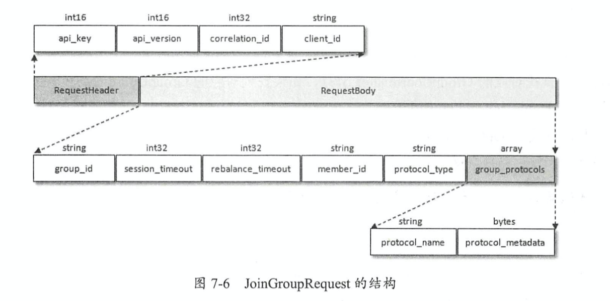
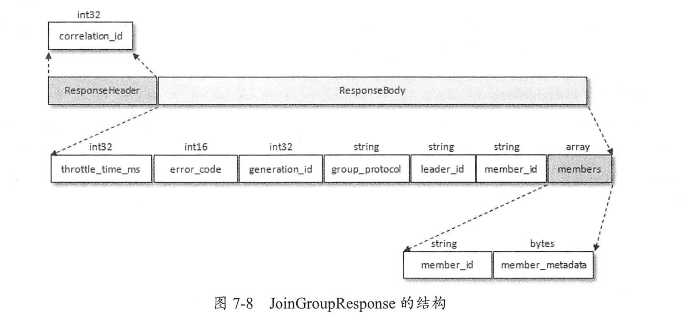
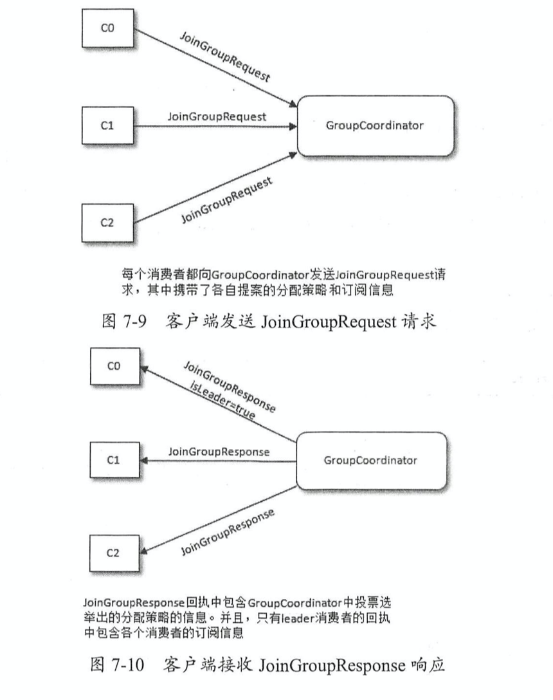
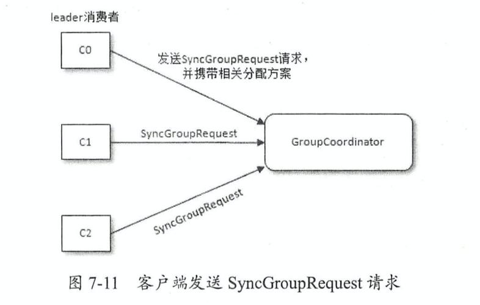

# 【Kafka Consumer】consumer 是如何加入 Consumer Group

consumer 比 producer 要复杂许多, producer 没有组的概念，也不需要关注 offset, 而consumer 不一样, 它有组织(consumer group), 有纪律(offset)。 这些对 consumer 的要求就会很高，这篇文章就先从 consumer 如何加入 consumer group 说起。

## 一、旧版 KafkaConsumer 的问题

ConsumerCoordinator(消费者协调器, 以下简称 CC)和 GroupCoordinator(消费者组协调器, 以下简称 GC) 都是针对新版本的消费者客户端(KafkaConsumer)而言的。 

旧版本的 KafkaConsumer 并未实现 CC 和 GC, 而是依靠 Zookeeper 的监听器(Listener) 来实现它们的功能。

每个消费组(\<group>)在 zk 中维护了一个 `/consumers/<group>/ids` 路径, 此路径下使用临时节点记录隶属于此消费者组的消费者的唯一标识(consumerIdString), consumerIdString 由消费者在启动时创建。consumerIdString 由 (consumer.id + hostname + timestamp + uuid 部分信息)组成, 而且其中的 consumer.id 是旧版本 kafka 消费者客户端的配置, 相当于新版本中的 cliend.id。例如某个旧版本的消费者客户端的 consumerIdString 可能是: "consumer001_localhost-1510734527562-64b377f5", 那么其中的 consumer001 就是配置的 consumer.id, localhost 就是主机名, 1510734527562 就是时间戳, 64b377f5就是部分 uuid。

与 `/consumers/<group>/ids` 同级的还有两个节点: owners 和 offsets, `/consumers/<group>/owner`  路径下记录了分区和消费者的对应关系, `/consumers/<group>/offsets` 路径下记录了此消费者组在分区中对应的消费位移。


每个 topic, broker 和 partition 在 zk 中也都对应了一个路径: 

- `/brokers/ids/<id>`

  broker 在 zk 中的路径, 记录了 host, port 及其分配在此 broker 上的主题分区列表; 

- `/brokers/topics/<topic>`

  topic 在 zk 中的路径, 记录了每个分区的 leader 副本、ISR 集合等信息

- `/brokers/topics/<topic>/partitions/<partition>/state` 

  记录了当前 leader 副本、leader_epoch 等信息

旧版本的每个 kafkaConsumer 启动的时候都会在 `/consumers/<group>/ids` 和 `/brokers/ids` 路径上注册一个监听器。

- `/consumers/<group>/ids` 路径下的子节点发生变化时, 表示消费组中的消费者发生了变化; 
- `/brokers/ids` 路径下的子节点发生变化时, 表示 broker 出现了增减。

这样通过 ZooKeeper 所提供的 watcher, 每个消费者就可以监听消费组和 kafka 集群的状态了。

这种方式下每个消费者对 ZooKeeper 的相关路径分别进行监听，当触发再均衡操作时，一个消费组下的所有消费者会同时进行再均衡操作，而消费者之间并不知道彼此操作的结果，这样可能导致Kafka工作在一个不正确的状态。与此同时，这种严重依赖于ZooKeeper集群的做 法还有两个比较严重的问题。

1. 羊群效应 (HerdEffect): 所谓的羊群效应是指 ZooKeeper 中一个被监听的节点变化，大量的 Watcher 通知被发送到客户端，导致在通知期间的其他操作延迟, 也有可能发生类似死锁的情况。

2. 脑裂问题 (SplitBrain): 消费者进行再均衡操作时每个消费者都与 ZooKeeper 进行通信以判断消费者或 broker 变化的情况, 由于 ZooKeeper 本身的特性, 可能导致在同一时刻各 个消费者获取的状态不一致，这样会导致异常问题发生。

## 二、新版本的 KafkaConsumer

新版的消费者客户端(KafkaConsumer)对此进行了重新设计，将全部消费组分成多个子集，每个消费组的子集在服务端对应一个 GroupCoordinator 对其进行管理。

GroupCoordinator 是运行在服务器上的一个服务, 负责 consumer 以及 offset 的管理。每个 Broker(Server) 在启动的时候，都会启动一个 GroupCoordinator 服务。消费者客户端中的 ConsumerCoordinator 组件负责与 GroupCoordinator 进行交互。

> Kafka 的 Server 端主要有三块内容：GroupCoordinator、Controller 和 ReplicaManager，其中，GroupCoordinator 的内容是与 Consumer 端紧密结合在一起的

ConsumerCoordinator 与 GroupCoordinator 之间最重要的职责就是负责执行消费者再均衡的 操作，包括前面提及的分区分配的工作也是在再均衡期间完成的。就目前而言， 一共有如下几种情形会触发再均衡的操作：

- 组内消费者发生变化:

  - 有新的消费者加入消费组。

  - 有消费者宕机下线。消费者并不一定需要真正下线，例如遇到长时间的 GC、网络延迟导致费者长时间未向 GroupCoordinator 发送心跳等情况时，GroupCoordinator 会认为消费者已经下线。

  - 有消费者主动退出消费组（发送 LeaveGroupRequest 请求)。比如客户端调用了 unsubscrible() 方法取消对某些主题的订阅。

- Topic 内分区发生变化:
  - 消费组内所订阅的任一主题或者主题的分区数量发生变化。 

- 消费组所对应的 GroupCoorinator 节点发生了变更。

下面就以一个简单的例子来讲解一下再均衡操作的具体内容。当有消费者加入消费组时，消费者、消费组及组协调器之间会经历以下几个阶段。

### 2.1 rebalance

#### 2.1.1 第一阶段 (FIND_COORDINATOR) 

消费者需要确定它所属的消费组对应的 GroupCoordinator 所在的 broker, 并创建与该broker 相互通信的网络连接。如果消费者已经保存了与消费组对应的 GroupCoordinator 节点的信息，并且与它之间的网络连接是正常的，那么就可以进入第二阶段。

否则，就需要向集群中的某个节点发送 FindCoordinatorRequest 请求来查找对应的GroupCoordinator, 这里的 “某个节点” 并非是集群中的任意节点，而是负载最小的节点，即 2.2.2 节中的 leastLoadedNode。

FindCoordinatorRequest 请求体中只有两个域(Field): coordinator_key 和 coordinator_ ype。coordinator_key 在这里就是消费组的名称，即 group.id, coordinator_type 置为 0。 这个 FindCoordinatorRequest 请求还会在 Kafka 事务（参考7.4.3 节）中提及，为了便于说明问题，这里我们暂且忽略它。

Kafka 在收到 FindCoordinatorRequest 请求之后，会根据 coordinator—key(也就是 groupId)查找对应的 GroupCoordinator 节点，如果找到对应的 GroupCoordinator 则会返回其相对应的 node_id、host和port信息。

具体查找 GroupCoordinator 的方式是先根据消费组 groupld 的哈希值计算__consumer_offsets 中的分区编号。消费组所对应的分区号的计算方式:

```java
// groupid.hashCode 就是使用 Java 中 String类的 hashCode() 
// groupMetadataTopicPartitionCount 为主题 __consumer_offsets 的分区个数，这个可以通过broker端参数 offsets.topic.num.partitions 来配置，默认值为50。
Utils.abs(groupid.hashCode) % groupMetadataTopicPartitionCount
```

找到对应的 __consumer_offsets 中的分区之后，再寻找此分区 leader 副本所在的broker 节点，该 broker 节点即为这个 groupld 所对应的 GroupCoordinator 节点 。消费者 groupld 最终的分区分配方案及组内消费者所提交的消费位移信息都会发送给此分区leader 副本所在的 broker 节点， 让此 broker 节点既扮演 GroupCoordinator 的角色，又扮演保存分区分配方案和组内消费者位移的角色，这样可以省去很多不必要的中间轮转所带来的开销。

> 这里说的比较抽象, 难理解! 这样来看, __consumer_offsets 也是一个 topic, 既然是 topic, 那么它也是用来保存消息的, 需要保存的这个消息就是消费组的消费位移消息, 那么这个消息添加到 topic 时, 肯定要定位到发送到哪个分区以及该分区的 leader 在哪个节点上。
>
> 所以, Utils.abs(groupid.hashCode) % groupMetadataTopicPartitionCount, 这个算法就是为了确定消费者消费位移的这条消息发送到 __consumer_offsets 这个 topic 的哪个分区, 确定分区后, 在寻找到该分区 leader 所在 broker, 那么在这个 broker 上启动的 GroupCoordinator 以后就专门来负责管理这个消费组的消费位移消息。

#### 2.1.2 第二阶段 (JOIN_GROUP)

在成功找到消费组所对应的 GroupCoordinator 之后就进入加入消费组的阶段， 在此阶段的 消费者会向 GroupCoordinator 发送 JoinGroupRequest 请求，并处理响应。

JoinGroupRequest 的结构包含多个域 ：

- group_id 就是消费组的 id ，通常也表示为 groupld。 
- session_timout 对应消费端参数 session.timeout.ms ，默认值为 10000 ，即 10 秒 。 
- GroupCoordinator 超过 session_timeout 指定的时间内没有收到心跳报文则 认为此消 费者已经下线。 
- rebalance_timeout 对应消费端参数 max.poll.interval.ms, 默认值为 300000, 即 5 分钟。表示当消费组再平衡的时候，GroupCoordinator 等待各个消费者 重新加入的最长等待时间 。 
- member_id 表示 GroupCoordinator 分配给消费者的 id 标识。消费者第一次发送  JoinGroupRequest 请求的时候此字段设置为 null。
- protocol_type 表示消费组实现的协议, 对于消费者而言此字段值为“consumer”。



JoinGroupRequest 中的 group_protocols 域为数组类型，其中可以囊括多个分区分配策 略，这个主要取决于消费者客户端参数 partition.assignment.strategy 的配置。如果 配置了多种策略，那么 JoinGroupRequest 中就会包含多个 protocol_name 和 protocol_metadata 。 其中 protocol_name 对应于 PartitionAssignor 接口中的 name（）方法，我们在讲述消费者分区分配策略的时候提及过相关内容。

如果是原有的消费者重新加入消费组，那么在真正发送 JoinGroupRequest 请求之前还要执 行一些准备工作：

- 如果消费端参数 enable.auto.commit 设置为 true （默认值也为 true ）， 即开启自动提交位移功能，那么在请求加入消费组之前需要向 GroupCoordinator 提交消费位移。这个过程是阻塞执行的，要么成功提交消费位移，要么超时。

- 如果消费者添加了自定义的再均衡监听器（ConsumerRebalanceListener），那么此时 会调用 onPartitionsRevoked（）方法在重新加入消费组之前实施自定义的规则逻辑，比如清除一些状态，或者提交消费位移等。

- 因为是重新加入消费组，之前与 GroupCoordinator 节点之间的心跳检测也就不需要了， 所以在成功地重新加入消费组之前需要禁止心跳检测的运作。

消费者在发送 JoinGroupRequest 请求之后会阻塞等待 Kafka 服务端的响应。服务端在收到 JoinGroupRequest 请求后会交由 GroupCoordinator 来进行处理。GroupCoordinator 首先会对 JoinGroupRequest 请求做合法性校验，比如 group_id 是否为空、当前 broker 节点是否是请求的消费者组所对应的组协调器、rebalance_timeout 的值是否在合理的范围之内。如果消费者是第一次请求加入消费组，那么 JoinGroupRequest 请求中的 member_id 值为 null，即没有它自身的唯一标志，此时组协调器负责为此消费者生成一个 member_id 。这个生成的算法很简单，具体如以下伪代码所示。

```scala
String memberid = clientId ＋ "-"＋ UUID.randomUUID().toString() ;
```

其中 clientId 为消费者客户端的 clientId，对应请求头中的 client_id 由此可见消费者的 member_id 由 clientId 和 UUID 用“－” 字符拼接而成。

**选举消费组的 leader**

GroupCoordinator 需要为消费组内的消费者选举出一个消费组的 leader，这个选举的算法也很简单，分两种情况分析。如果消费组内还没有 leader，那么第一个加入消费组的消费者即为 消费组的 leader。如果某一时刻 leader 消费者由于某些原因退出了消费组，那么会重新选举一个新的 leader，这个重新选举 leader 的过程又更“随意”了，相关代码如下 ：

```scala
private val members = new mutable .HashMap[String, MemberMetadata]
var leaderid = members.keys.head
```

**选举分区分配策略**

每个消费者都可以设置自己的分区分配策略，对消费组而言需要从各个消费者呈报上来的各个分配策略中选举一个彼此都“信服”的策略来进行整体上的分区分配。 这个分区分配的选举并非由 leader 消费者决定，而是根据消费组内的各个消费者投票来决定的。这里所说的 “根据组内的各个消费者投票来决定”不是指 GroupCoordinator 还要再与各个消费者进行进一步交互，而是根据各个消费者呈报的分配策略来实施。最终选举的分配策略基本上可以看作被各个消费者支持的最多的策略，具体的选举过程如下：

- 收集各个消费者支持的所有分配策略，组成候选集 candidates。
- 每个消费者从候选集 candidates 中找出第一个自身支持的策略，为这个策略投上一票。
- 计算候选集中各个策略的选票数，选票数最多的策略即为当前消费组的分配策略。

如果有消费者并不支持选出的分配策略，那么就会报出异常 IllegalArgumentException: Member does not support protocol。 需要注意的是，这里所说的“消费者所支持的分配策略”是指 partition.assignment.strategy 参数配置的策略，如果这个参数值只配置了 RangeAssignor，那么这个消费者客户端只支持 RangeAssignor 分配策略。

在此之后，Kafka 服务端就要发送 JoinGroupResponse 响应给各个消费者，leader 消费者和其他普通消费者收到的响应内容并不相同，首先我们看一下 JoinGroupResponse 的具体结构:



JoinGroupResponse 包含了多个域，其中 generation_id 用来标识当前消费组的年代信 息，避免受到过期请求的影响。 leader_id 表示消费组 leader 消费者的 member_id 。

Kafka 发送给普通消费者的 JoinGroupResponse 中的 members 内容为空，而只有 leader 消费者的 JoinGroupResponse 中的 members 包含有效数据。 members 为数组类型，其中包含各个成员信息。 member_metadata 为消费者的订阅信息，与 JoinGroupRequest 中的 protocol metadata 内容相同，不同的是 JoinGroupRequest 可以包含多个 <protocol_name, protocol_metadata> 的键值对，在收到 JoinGroupRequest 之后，GroupCoordinator 已经选举出唯一的分配策略。也就是说， protocol_name 己经确定（group_protocol)，那么对应的 protocol_metadata 也就确定了，最终各个消费者收到的 JoinGroupResponse 响应中的 member_metadata 就是这个确定了的 protocol_metadata。 由此可见， Kafka 把分区分配的具体分配交还给客户端，自身并不参与具体的分配细节，这样即使以后分区分配的策略发生了变更，也只需要重启消费端的应用即可，而不需要重启服务端。

本阶段的内容可以简要概括为下图:



#### 2.1.3 第三阶段 (SYNC_GROUP)

leader 消费者根据在第二阶段中选举出来的分区分配策略来实施具体的分区分配，在此之后需要将分配的方案同步给各个消费者，此时 leader 消费者并不是直接和其余的普通消费者同步分配方案， 而是通过 GroupCoordinator 这个“中间人”来负责转发同步分配方案的。 在第三阶段，也就是同步阶段，各个消费者会 向 GroupCoordinator 发送 SyncGroupRequest 请求来同步分配方案:



我们再来看一下 SyncGroupRequest 请求的具体结构 ，如图 7-12 所示 。 SyncGroupRequest 中的 group_id、 generation_id 和 member_id 前面都有涉及，这里不再赘述。 只有 leader 消费者发送的 SyncGroupRequest 请求中才包含具体的分区分配方案，这个分配方案保存在 group_assignment 中 ，而其余消费者发送的 SyncGroupRequest 请求中的 group_assignment 为空。


group_assignment 是一个数组类型，其中包含了各个消费者对应的具体分配方案：

member_id 表示消费者的唯一标识，而 member_assignment 是与消费者对应的分配方案，它还可以做更具体的划分， member_assignment 的结构如图 7-13 所示 。


与 JoinGroupRequest 请求中的 protocol_metadata 类似，都可以细分为 3 个更具体的字段，只不过 protocol_metadata 存储的是主题的列表信息，而 member_assignment 存储的是分区信息，member_assignment 中可以包含多个主题的多个分区信息。

服务端在收到消费者发送的 SyncGroupRequest 请求之后会交由 GroupCoordinator 来负责具 体的逻辑处理。 GroupCoordinator 同样会先对 SyncGroupRequest 请求做合法性校验，在此之后会将从 leader 消费者发送过来的分配方案提取出来，连同整个消费组的元数据信息一起存入 Kafka 的 __consumer_offsets topic 中，最后发送响应给各个消费者以提供给各个消费者各自所属的分配方案。

这里所说的响应就是指 SyncGroupRequest 请求对应的 SyncGroupResponse, SyncGroupResponse 的内容很简单，里面包含的就是消费者对应的所属分配方案， SyncGroupResponse 的结构如图 7-14 所示，具体字段的释义可以从前面的内容中推测出来，这里就不赘述了。


当消费者收到所属的分配方案之后会调用 PartitionAssignor#onAssignment() 方法。随后再调用 ConsumerRebalanceListener#OnPartitionAssigned()方法。 之后开启心跳任务， 消费者定期向服务端的 GroupCoordinator 发送 HeartbeatRequest 来确定彼此在线。

**消费组元数据信息**

我们知道消费者客户端提交的消费位移会保存在 Kafka 的 __consumer_offsets 主题中，这里也一样，只不过保存的是消费组的元数据信息 (GroupMetadata)。具体来说，每个消费组的元数据信息都是一条消息，不过这类消息并不依赖于具体版本的消息格式，因为它只定义了消息中的 key 和 value 字段的具体内容，所以消费组元数据信息的保存可以做到与具体的消息格式无关。

图 7-15 中对应的就是消费组元数据信息的具体内容格式，上面是消息的 key，下面是消息的 value 。可以看到 key 和 value 中都包含 version 字段，用来标识具体的 key 和 value 的版本信息， 不同的版本对应的内容格式可能并不相同，就目前版本而言， key 的 version 为 2 ，而 value 的 version 为 1， 读者在理解时其实可以忽略这个字段而探究其具备特定含义的内容。 key 中除了 version 就是 group 宇段，它表示消费组的名称和 JoinGroupRequest 或 SyncGroupRequest 请求中的 group_id 是同一个东西。虽然 key 中包含了 version 字段， 但确定这条信息所要存储的分区还是根据单独的 group 字段来计算的，这样就可以保证消费组 的元数据信息与消费组对应的 GroupCoordinator 处于同一个 broker 节点上，省去了中间轮转的开销。


value 中包含的内容有很多，可以参照和 JoinGroupRequest 或 SyncGroupRequest 请求中的内容来理解，具体各个字段的释义如下 。

- protocol_type: 消费组实现的协议，这里的值为“ consumer”。 
- generation: 标识当前消费组的年代信息，避免收到过期请求的影响。 
- protocol: 消费组选取的分区分配策略。 
- leader: 消费组的 leader 消费者的名称。 
- members: 数组类型，其中包含了消费组的各个消费者成员信息，图 7-15 中右边部分 就是消费者成员的具体信息，每个具体字段都比较容易辨别，需要着重说明的是 subscription 和 assignment 这两个字段，分别代码消费者的订阅信息和分配信息。

#### 2.1.4 第四阶段 (HEARTBEAT)

进入这个阶段之后，消费组中的所有消费者就会处于正常工作状态。在正式消费之前，消费者还需要确定拉取消息的起始位置。假设之前已经将最后的消费位移提交到了 GroupCoordinator， 并且 GroupCoordinator 将其保存到了 Kafka 内部的 __consumer_offsets 主题中， 此时消费者可以通过 OffsetFetchRequest 请求获取上次提交的消费位移并从此处继续消费 。

消费者通过向 GroupCoordinator 发送心跳来维持它们与消费组的从属关系，以及它们对分区的所有权关系。只要消费者以正常的时间间隔发送心跳，就被认为是活跃的，说明它还在读取分区中的消息。心跳线程是一个独立的线程，可以在轮询消息的空档发送心跳。如果消费者停止发送心跳的时间足够长，则整个会话就被判定为过期， GroupCoordinator 也会认为这个消费者己经死亡，就会触发一次再均衡行为。 消费者的心跳间隔时间由参数 heartbeat.interval.ms 指定，默认值为 3000 即 3 秒， 这个参数必须比 session.timeout.ms 参数设定的值要小，一般情况下 heartbeat.interval.ms 的配置值不能超过 session.timeout.ms 配置值的 1/3 。这个参数可以调整得更低，以控制正常重新平衡的预期时间。

如果一个消费者发生崩溃，并停止读取消息，那么 GroupCoordinator 会等待一小段时间，确认这个消费者死亡之后才会触发再均衡。在这一小段时间内，死掉的消费者井不会读取分区里的消息。这个一小段时间由 session.timeout.ms 参数控制，该参数的配置值必须在 broker 端参数 group.min.session.timeout.ms(默认值为 6000, 即 6 秒）和 group.max.session. timeout.ms （默认值为 300000, 即 5 分钟）允许的范围内。

还有一个参数 max.poll.interval.ms，它用来指定使用消费者组管理时 poll() 方法调用之间的最大延迟 ，也就是消费者在获取更多消息之前可以空闲的时间量的上限。如果此超时时间期满之前 poll() 没有调用， 则消费者被视为失败，并且分组将重新平衡，以便将分区重新分配给别的成员。

除了被动退出消费组，还可以使用 LeaveGroupRequest 请求主动退出消费组，比如客户端调用了unsubscrible() 方法取消对某些主题的订阅，这个比较简单，这里就不再赘述了 。

#### 2.1.5 小结

简单说一下 rebalance 过程：

1. 当一些条件发生时将 group 从 **Stable** 状态变为 **PreparingRebalance**；
2. 然后就是等待 group 中的所有 consumer member 发送 join-group 请求加入 group，如果都已经发送 join-group 请求，此时 GroupCoordinator 会向所有 member 发送 join-group response，那么 group 的状态变为 **AwaitingSync**；
3. leader consumer 会收到各个 member 订阅的 topic 详细信息，等待其分配好 partition 后，通过 sync-group 请求将结果发给 GroupCoordinator（非 leader consumer 发送的 sync-group 请求的 data 是为空的）；
4. 如果 GroupCoordinator 收到了 leader consumer 发送的 response，获取到了这个 group 各个 member 所分配的 topic-partition 列表，group 的状态就会变成 **Stable**。

### 2.2 rebalance 源码分析

先来回顾下消费消息的流程:

```scala
// 创建消费者
KafkaConsumer<String, String> consumer = new KafkaConsumer<>(props);

// 订阅主题
consumer.subscribe(Collections.singletonList("consumerCodeTopic"))

// 从服务端拉取数据
ConsumerRecords<String, String> records = consumer.poll(Duration.ofMillis(100));
```

#### 2.2.1 KafkaConsumer#subscribe(Set\<String>)

在创建 KafkaConsumer 的时候会先创建 ConsumerCoordinator, 由它来负责和 GroupCoordinator 通信

```java
this.coordinator = new ConsumerCoordinator(...);
```

KafkaConsumer 是线程不安全的，同时只能允许一个线程运行。因此在 subscribe/unsubscribe 和 poll 的时候会使用 acquireAndEnsureOpen() 进行判定，如果有多个线程同时使用一个KafkaConsumer 则会抛出异常

```java
private void acquire() {
  long threadId = Thread.currentThread().getId();
  // 使用 Atomic 防止 KafkaComsumer 实例在多线程中被竞争, 这个方法太机智了!
  if (threadId != currentThread.get() && !currentThread.compareAndSet(NO_CURRENT_THREAD, threadId))
      throw new ConcurrentModificationException("KafkaConsumer is not safe for multi-threaded access");
  refcount.incrementAndGet();
}
```

接着就开始订阅主题，订阅的方式有好几种，上一篇文章有提到过。订阅的时候会设置当前订阅类型为SubscriptionType.AUTO_TOPICS, 默认存在四种类型

```java
public class SubscriptionState {
 private enum SubscriptionType {
    // 默认
    NONE,
    // subscribe方式 
    AUTO_TOPICS, 
    // pattern方式订阅
    AUTO_PATTERN,
    // assign方式
    USER_ASSIGNED
  }
}
```

KafkaConsumer#subscribe()

```java
public void subscribe(Collection<String> topics, ConsumerRebalanceListener listener) {
  // 确保 KafkaConsumer 实例不存在线程间竞争
  acquireAndEnsureOpen();
  try {
    // 未设置 group.id 报错
    maybeThrowInvalidGroupIdException();
    // topic == null 报错
    if (topics == null)
      throw new IllegalArgumentException("Topic collection to subscribe to cannot be null");
    // 如果 topic 集合为空集合, 本质调用  unsubscribe, 将 Consumer 实例离开消费组
    if (topics.isEmpty()) {
      // treat subscribing to empty topic list as the same as unsubscribing
      this.unsubscribe();
    } else {
      for (String topic : topics) {
        if (topic == null || topic.trim().isEmpty())
          throw new IllegalArgumentException("Topic collection to subscribe to cannot contain null or empty topic");
      }
			// partition.assignment.strategy 该参数未配置报错(有默认配置)
      throwIfNoAssignorsConfigured();
      // fetcher 中先清除之前可能存在的已经订阅的 TopicPartition
      fetcher.clearBufferedDataForUnassignedTopics(topics);
      log.info("Subscribed to topic(s): {}", Utils.join(topics, ", "));
      // 订阅的本质: 将 SubscriptionState 中的成员变量 subscription 设置为目标参数 topics
      if (this.subscriptions.subscribe(new HashSet<>(topics), listener))
        // 更新 Consumer 的元数据信息: ConsumerMetaData, 主要更改了成员变量 requestVersion++, needUpdate = true
        metadata.requestUpdateForNewTopics();
    }
  } finally {
    // 释放 Atomic 锁: refcount, 并重置 Atomic: currentThread = -1
    release();
  }
}
```

#### 2.2.2 KafkaConsumer#poll(Duration)

订阅完成后，就可以从服务器拉取数据了，consumer 没有后台线程默默的拉取数据，它的所有行为都集中在 poll() 方法中

一个 Consumer 实例消费数据的前提是能够加入一个 group 成功，并获取其要订阅的 tp（topic-partition）列表，因此首先要做的就是和 GroupCoordinator 建立连接，加入组织，因此我们先把目光集中在 ConsumerCoordinator#poll() 方法中首先会去更新 metadata 信息(获取 GroupCoordinator 的 ip 以及接口, 并连接 join-Group、sync-group, 期间 group 会进行 rebalance )

```java
private ConsumerRecords<K, V> poll(final long timeoutMs, final boolean includeMetadataInTimeout) {

  ...

    do {
      client.maybeTriggerWakeup();
      final long metadataEnd;
      if (includeMetadataInTimeout) {
        // 连接 GroupCoordinator 以及 消费组加入组的逻辑都在 coordinator.poll(Timer) 中
        if (!updateAssignmentMetadataIfNeeded(remainingTimeAtLeastZero(timeoutMs, elapsedTime))) {
          return ConsumerRecords.empty();
        }
        ...
      } else {
        while (!updateAssignmentMetadataIfNeeded(Long.MAX_VALUE)) {
          log.warn("Still waiting for metadata");
        }
        metadataEnd = time.milliseconds();
      }

      final Map<TopicPartition, List<ConsumerRecord<K, V>>> records = pollForFetches(remainingTimeAtLeastZero(timeoutMs, elapsedTime));
      ...

    } while (elapsedTime < timeoutMs);

  ...

}

boolean updateAssignmentMetadataIfNeeded(final long timeoutMs) {
  final long startMs = time.milliseconds();
  if (!coordinator.poll(timeoutMs)) {
    return false;
  }

  return updateFetchPositions(remainingTimeAtLeastZero(
      timeoutMs, time.milliseconds() - startMs));
}
```

关于对 ConsumerCoordinator 的处理都集中在 coordinator.poll()方法中。

**ConsumerCoordinator#poll(Timer)**

```java
public boolean poll(Timer timer) {
  maybeUpdateSubscriptionMetadata();

  invokeCompletedOffsetCommitCallbacks();
	// 确保 subscriptionType=(AUTO_TOPICS|AUTO_PATTERN), 因为如果subscriptionType=USER_ASSIGNED, 则不该进入该方法内
  if (subscriptions.partitionsAutoAssigned()) {
    if (protocol == null) {
      throw new IllegalStateException("User configured " + ConsumerConfig.PARTITION_ASSIGNMENT_STRATEGY_CONFIG +
                                      " to empty while trying to subscribe for group protocol to auto assign partitions");
    }
    // 始终更新心跳的上次轮询时间，以使心跳线程不会因应用程序不活动而主动离开组，即使（例如）找不到协调器也是如此。
    pollHeartbeat(timer.currentTimeMs());
    // 如果 coordinator 未知, 初始化 ConsumerCoordinator, 逻辑就在 ensureCoordinatorReady(Timer) 中, 之后调用 lookupCoordinator() 方法
    if (coordinatorUnknown() && !ensureCoordinatorReady(timer)) {
      return false;
    }
		// 判断是需要重新加入group, 如果订阅的partition变化或者分配的partition变化
    if (rejoinNeededOrPending()) {
      // 由于 initial metadata fetch 和 initial rebalance 之间存在竞争条件，因此我们需要确保在初始加入之前 metadata 是最新的。这样可以确保在加入之前，我们已经将 pattern 与 topic 进行了至少一次匹配。
      if (subscriptions.hasPatternSubscription()) {
      // 对于使用基于 pattern 的 subscribe 的使用者组，在创建 topic 后，任何在元数据刷新后发现该 topic 的 consumr 都可以触发整个使用者组的重新平衡。
      // 如果 consumr 在不同的时间刷新元数据，则在创建一个主题后可以触发多个重新平衡。只要刷新刷新时间已过，我们可以要求 consumr 在重新加入组之前刷新元数据，从而显着减少由单个主题创建引起的重新平衡次数。
        if (this.metadata.timeToAllowUpdate(timer.currentTimeMs()) == 0) {
          this.metadata.requestUpdate();
        }

        if (!client.ensureFreshMetadata(timer)) {
          return false;
        }

        maybeUpdateSubscriptionMetadata();
      }
			// 确保 group 是 active，consumer 加入 group，分配订阅的 partition
      if (!ensureActiveGroup(timer)) {
        return false;
      }
    }
  } else {
    // For manually assigned partitions, if there are no ready nodes, await metadata.
    // If connections to all nodes fail, wakeups triggered while attempting to send fetch
    // requests result in polls returning immediately, causing a tight loop of polls. Without
    // the wakeup, poll() with no channels would block for the timeout, delaying re-connection.
    // awaitMetadataUpdate() initiates new connections with configured backoff and avoids the busy loop.
    // When group management is used, metadata wait is already performed for this scenario as
    // coordinator is unknown, hence this check is not required.
    if (metadata.updateRequested() && !client.hasReadyNodes(timer.currentTimeMs())) {
      client.awaitMetadataUpdate(timer);
    }
  }
	// 如果设置的是自动 commit,如果定时达到则自动 commit
  maybeAutoCommitOffsetsAsync(timer.currentTimeMs());
  return true;
}
```

poll 方法中，具体实现可以分为四个步骤

1. 检测心跳线程运行是否正常(在建立连接之后,定时向 GroupCoordinator 发送心跳。建立连接之前不会做任何事情)
2. 通过subscribe()方法订阅topic,如果 coordinator 未知，就初始化 Consumer Coordinator(在 ensureCoordinatorReady() 中实现，主要的作用是发送 FindCoordinatorRequest 请求，并建立连接）
3. 判断是否需要重新加入 group, 如果订阅的 partition 变化或者分配的 partition 变化时，需要 rejoin, 通过 ensureActiveGroup() 发送 join-group、sync-group 请求，加入 group 并获取其 assign 的 TopicPartition list。
4. 如果设置的是自动 commit, 并且达到了发送时限则自动 commit offset

关于 rejoin,下列几种情况会触发再均衡(reblance)操作

- 新的消费者加入消费组(第一次进行消费也属于这种情况)
- 消费者宕机下线(长时间未发送心跳包)
- 消费者主动退出消费组，比如调用unsubscrible()方法取消对主题的订阅
- 消费组对应的GroupCoorinator节点发生了变化
- 消费组内所订阅的任一主题或者主题的分区数量发生了变化

> 取消 topic 订阅，consumer 心跳线程超时以及在 Server 端给定的时间未收到心跳请求，这三个都是触发的 LEAVE_GROUP 请求

这其中我会重点介绍下第二步中的 ensureCoordinatorReady() 方法和第三步中的ensureActiveGroup() 方法。

**ensureCoordinatorReady**

这个方法主要作用就是选择一个连接数最少的 broker(还未响应请求最少的broker)，发送FindCoordinator 请求，并建立对应的 TCP 连接。

- 方法调用流程是 ensureCoordinatorReady() –> lookupCoordinator() –> sendGroupCoordinatorRequest()。
- 如果 client 收到 response, 那么就与 GroupCoordinator 建立连接

```java
protected synchronized boolean ensureCoordinatorReady(final long timeoutMs) {
  if (!coordinatorUnknown())
    return true;

  do {
    // 找到GroupCoordinator，并建立连接
    final RequestFuture<Void> future = lookupCoordinator();
    client.poll(future, timer);

    if (!future.isDone()) {
      // ran out of time
      break;
    }

    if (future.failed()) {
      if (future.isRetriable()) {
        log.debug("Coordinator discovery failed, refreshing metadata");
        client.awaitMetadataUpdate(timer);
      } else
        throw future.exception();
    } else if (coordinator != null && client.isUnavailable(coordinator)) {
      // 如果找到 GroupConnrdinator, 但此时的连接已经不可用, 则将 connrdinator 指针置位 unknown
      markCoordinatorUnknown();
      timer.sleep(rebalanceConfig.retryBackoffMs);
    }
  } while (coordinatorUnknown() && timer.notExpired());

  return !coordinatorUnknown();
}

// 找到coordinator
protected synchronized RequestFuture<Void> lookupCoordinator() {
  if (findCoordinatorFuture == null) {
    // 找一个最少连接的节点: 就是 ip, port, racknum,
    Node node = this.client.leastLoadedNode();
    if (node == null) {
      log.debug("No broker available to send FindCoordinator request");
      return RequestFuture.noBrokersAvailable();
    } else
      // 发送FindCoordinator request请求
      findCoordinatorFuture = sendFindCoordinatorRequest(node);
  }
  return findCoordinatorFuture;
}

// 发送FindCoordinator请求
private RequestFuture<Void> sendFindCoordinatorRequest(Node node) {
  log.debug("Sending FindCoordinator request to broker {}", node);
  FindCoordinatorRequest.Builder requestBuilder =
    new FindCoordinatorRequest.Builder(FindCoordinatorRequest.CoordinatorType.GROUP, this.groupId);
  // 发送请求，并将response转换为RequestFuture
  return client.send(node, requestBuilder)
    .compose(new FindCoordinatorResponseHandler());
}

// 根据response返回的 ip, port 和 GroupCoordinator 建立连接
private class FindCoordinatorResponseHandler extends RequestFutureAdapter<ClientResponse, Void> {

  @Override
  public void onSuccess(ClientResponse resp, RequestFuture<Void> future) {
    log.debug("Received FindCoordinator response {}", resp);

    FindCoordinatorResponse findCoordinatorResponse = (FindCoordinatorResponse) resp.responseBody();
    Errors error = findCoordinatorResponse.error();
    if (error == Errors.NONE) {
      synchronized (AbstractCoordinator.this) {
        int coordinatorConnectionId = Integer.MAX_VALUE - findCoordinatorResponse.node().id();
        AbstractCoordinator.this.coordinator = new Node(
          coordinatorConnectionId,
          findCoordinatorResponse.node().host(),
          findCoordinatorResponse.node().port());
        // 初始化连接
        client.tryConnect(coordinator);
        // 更新心跳时间
        heartbeat.resetTimeouts(time.milliseconds());
      }
      future.complete(null);
    } 
    ...
  }
```

上面代码主要作用就是向一个负载最小的节点发起 FindCoordinatorRequest 请求(client.send()方法底层使用的是 java NIO, 在上一篇文章中分析过), Kafka 在走到这个请求后会根据 group_id 查找对应的 GroupCoordinator 节点，如果找到对应的则会返回其对应的 node_id, host 和 port 信息

> 这里的 GroupCoordinator 节点的确定在文章开头提到过,是通过 group.id 和partitionCount 来确定的

**ensureActiveGroup**

现在已经知道了 GroupCoordinator 节点, 并建立了连接。ensureActiveGroup() 这个方法的主要作用是向 GroupCoordinator 发送 join-group、sync-group 请求，获取 assign 的TopicPartition list。

- 调用过程是 ensureActiveGroup() -> ensureCoordinatorReady() -> startHeartbeatThreadIfNeeded() -> joinGroupIfNeeded()
- joinGroupIfNeeded() 方法中最重要的方法是 initiateJoinGroup(), 它的的调用流程是 disableHeartbeatThread() -> sendJoinGroupRequest() -> JoinGroupResponseHandler::handle()
  -> onJoinLeader(), onJoinFollower() -> sendSyncGroupRequest()

```java
boolean ensureActiveGroup(long timeoutMs, long startMs) {

  if (!ensureCoordinatorReady(timeoutMs)) {
    return false;
  }

  // 启动心跳线程
  startHeartbeatThreadIfNeeded();

  long joinStartMs = time.milliseconds();
  long joinTimeoutMs = remainingTimeAtLeastZero(timeoutMs, joinStartMs - startMs);
  return joinGroupIfNeeded(joinTimeoutMs, joinStartMs);
}

```

心跳线程就是在这里启动的，但是并不一定马上发送心跳包，会在满足条件之后才会开始发送。后面最主要的逻辑就集中在 joinGroupIfNeeded() 方法，它的核心代码如下:

```java
boolean joinGroupIfNeeded(final long timeoutMs, final long startTimeMs) {
  while (rejoinNeededOrPending()) {
    if (!ensureCoordinatorReady(remainingTimeAtLeastZero(timeoutMs, elapsedTime))) {
      return false;
    }
    if (needsJoinPrepare) {
      // 如果是自动提交,则要开始提交 offset 以及在 joingroup 之前回调reblanceListener 接口
      onJoinPrepare(generation.generationId, generation.memberId);
      needsJoinPrepare = false;
    }

    // 发送join group请求
    final RequestFuture<ByteBuffer> future = initiateJoinGroup();

    ...

      if (future.succeeded()) {

        ByteBuffer memberAssignment = future.value().duplicate();

        // 发送完成
        onJoinComplete(generation.generationId, generation.memberId, generation.protocol, memberAssignment);

        resetJoinGroupFuture();
        needsJoinPrepare = true;
      }
  }
```

initiateJoinGroup()的核心代码如下:

```java
private synchronized RequestFuture<ByteBuffer> initiateJoinGroup() {

  if (joinFuture == null) {

    // 禁止心跳线程运行
    disableHeartbeatThread();

    // 设置当前状态为rebalance
    state = MemberState.REBALANCING;
    // 发送joinGroup请求
    joinFuture = sendJoinGroupRequest();
    joinFuture.addListener(new RequestFutureListener<ByteBuffer>() {
      @Override
      public void onSuccess(ByteBuffer value) {

        synchronized (AbstractCoordinator.this) {
          // 设置状态为stable状态    
          state = MemberState.STABLE;
          rejoinNeeded = false;

          if (heartbeatThread != null)
            // 允许心跳线程继续运行
            heartbeatThread.enable();
        }
      }
      @Override
      public void onFailure(RuntimeException e) {

        synchronized (AbstractCoordinator.this) {
          // 如果joinGroup失败，设置状态为unjoined
          state = MemberState.UNJOINED;
        }
      }
    });
  }
  return joinFuture;
}
```

可以看到在 joinGroup 之前会让心跳线程暂时停下来，此时会将 ConsumerCoordinator 的状态设置为 rebalance 状态，当 joinGroup 成功之后会将状态设置为 stable 状态，同时让之前停下来的心跳继续运行。

在发送 joinGroupRequest 之后, 收到服务器的响应，会针对这个响应在做一些重要的事情

```java
private class JoinGroupResponseHandler extends CoordinatorResponseHandler<JoinGroupResponse, ByteBuffer> {
  @Override
  public void handle(JoinGroupResponse joinResponse, RequestFuture<ByteBuffer> future) {
    Errors error = joinResponse.error();
    if (error == Errors.NONE) {
      synchronized (AbstractCoordinator.this) {
        if (state != MemberState.REBALANCING) {
          future.raise(new UnjoinedGroupException());
        } else {
          AbstractCoordinator.this.generation = new Generation(joinResponse.generationId(),
                                                               joinResponse.memberId(), joinResponse.groupProtocol());
          // 如果当前consumer是leader
          if (joinResponse.isLeader()) {
            onJoinLeader(joinResponse).chain(future);
          } else {
            // 是follower
            onJoinFollower().chain(future);
          }
        }
      }
    }
    ...
  }
```

1. 当 GroupCoordinator 接收到 consumer 的 join-group 请求后，由于此时这个 group 的 member 列表还是空(group 是新建的，每个 consumer 实例被称为这个 group 的一个 member)，第一个加入的 member 将被选为 leader，也就是说，对于一个新的 consumer group 而言，当第一个 consumer 实例加入后将会被选为 leader。如果后面leader挂了，会从其他 member 里面随机选择一个 member成为新的 leader
2. 如果 GroupCoordinator 接收到 consumer 发送 join-group 请求，会将所有 menber 列表以及分区策略返回其 response
3. consumer 在收到 GroupCoordinator 的 response 后，如果这个 consumer 是group的leader,那么这个consumer 会负责为整个 group 分配分区(默认是range策略,分区策略会在后续文章进行讲解),然后 leader 会发送 SyncGroup(sendSyncGroupRequest()方法)请求，将分配信息发送给 GroupCoordinator, 作为 follower 的 consumer 则只是发送一个空列表。
4. GroupCoordinator 在接收到 leader 发送来的请求后，会将 assign 的结果返回给所有已经发送 sync-group 请求的 consumer 实例。并且 group 的状态会转变为 stable.如果后续再收到 sync-group 请求，由于 group 的状态已经是 Stable，将会直接返回其分配结果。

sync-group发送请求核心代码如下

```java
//根据返回的assignmenet strategy name来决定采用何种策略进行分区分配
Map<String, ByteBuffer> groupAssignment = performAssignment(
  											joinResponse.leaderId(), 										
  											joinResponse.groupProtocol(),                                                           												joinResponse.members());

SyncGroupRequest.Builder requestBuilder =
  new SyncGroupRequest.Builder(
  							groupId, 
  							generation.generationId, 
  							generation.memberId, 
  							groupAssignment);

log.debug("Sending leader SyncGroup to coordinator {}: {}", this.coordinator, requestBuilder);

return sendSyncGroupRequest(requestBuilder);
```


这个阶段主要是讲分区分配方案同步给各个消费者，这个同步仍然是通过GroupCoordinator来转发的。

> 分区策略并非由leader消费者来决定，而是各个消费者投票决定的,谁的票多就采用什么分区策略。这里的分区策略是通过partition.assignment.strategy参数设置的，可以设置多个。如果选举除了消费者不支持的策略，那么就会抛出异常IllegalArgumentException: Member does not support protocol

经过上面的步骤，一个 consumer 实例就已经加入 group 成功了，加入 group 成功后，将会触发 ConsumerCoordinator 的 onJoinComplete() 方法，其作用就是：更新订阅的 tp 列表、更新其对应的 metadata 及触发注册的 listener。

然后消费者就进入正常工作状态,同时消费者也通过向 GroupCoordinator 发送心跳来维持它们与消费者的从属关系，已经它们对分区的所有权关系。只要以正常的间隔发送心跳，就被认为是活跃的，但是如果 GroupCoordinator 没有响应，那么就会发送 LeaveGroup 请求退出消费组。

## 三、__consumer_offsets 剖析

位移提交是使用消费者客户端过程中一个比较“讲究”的操作 ， 3.2.5节也使用了较大的篇幅来介绍它。位移提交的内容最终会保存到 Kafka 的内部主题 __consumer_offsets 中，对于主题\_\_consumer_offsets 的深度掌握也可以让我们更好地理解和使用好位移提交。

一般情况下，当集群中第一次有消费者消费消息时会自动创建主题 __consumer_offsets，不过它的副本因子还受 offsets.topic.replication. factor 参数的约束，这个参数的默认值为 3 ，分区数可以通过 offsets.topic.num.partitions 参数设置，默认为 50 。客户端提交消费位移是使用的是 OffsetCommitRequest 请求实现的， OffsetCommitRequest 的结构如图

